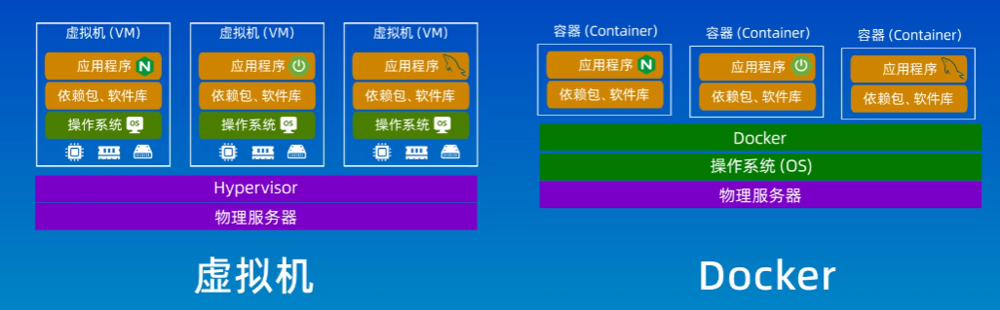

## Docker和虚拟机的关系与区别？
虚拟机：通过虚拟化技术把物理的服务器，虚拟成多个虚拟的服务器，缺点是占用大量资源和启动速度慢。是一个完整的操作系统


## Docker基础概念

镜像：类比Java中的类

容器: 类比Java中的实例

## 配置国内阿里云镜像
在linux系统中/etc/docker/daemon.json文件中添加
```json
{
    "registry-mirrors": ["<镜像加速器地址>"]
}            
```

## 基础命令
```docker
docker pull xxx 拉取镜像

docker images 查看镜像

docker run xxx 运行镜像
```