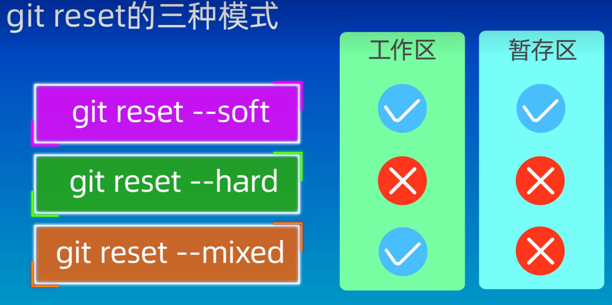
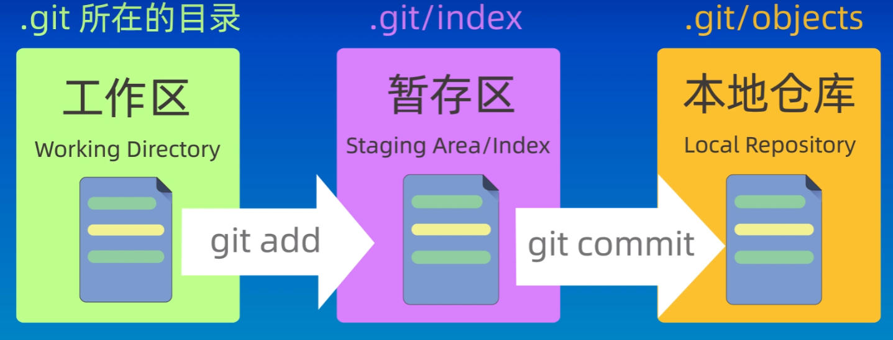
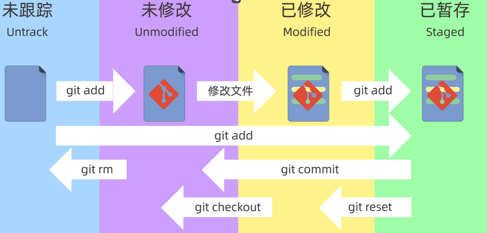

# Git基本命令
### config相关配置命令
```git
git config --global user.name "填写用户名"
git config --global user.email "填写邮箱"
git config --global credential.helper store 保存用户名和邮箱不用重复配置
git config --global --list 查看配置信息 
```

### 新建仓库
前提：C:\Users\Mommrm\Desktop\基础笔记\Git笔记\learn-git在此目录下创建仓库
```git
init git my-repo (后面可以加参数，表面在原本目录下再创建一个文件夹my-repo创建仓库)
ls -a 查看隐藏目录
```

### 添加和提交文件命令
```linux
echo "这是第一个文件" > file1.txt //linux回声 输入到file1.txt文件

cat file1.txt //抓取file1.txt文件内容 cat命令用于显示文件的内容

mv file(旧).txt file4(新).txt (修改文件名)

cp -rf repo repo-soft
```
在上面创建了一个file1.txt文件后：
file1.txt文件状态是untrack状态
```git
git add file1.txt 把文件添加到暂存区内
git add *.txt 把所有txt文件添加到暂存区
git add . 把当前目录下所有的文件都添加到暂存区

git commit -m "填写提交信息" (不写会启动vim填写提交信息) 只会把暂存区的文件进行提交
git commit -am "填写提交信息" (会增加到暂存区并提交)

git log 查看仓库提交的历史记录（可以加--oneline查看简洁版本)
```

### Git回退版本

```git
git reset --soft ef89035(这里是版本号)

git reset --hard HEAD^

git ls-files(查看暂存区内容)
```

### 差异对比
```git
git diff (对比的是工作区和暂存区的内容)

git diff HEAD(对比的是工作区+暂存区和本地仓库)

git diff --cached(对比的是暂存区和本地仓库)

git diff 版本号1 版本号2 (比较提交之间的差异)
git diff HEAD~ HEAD

git diff 分支名1 分支名2 (比较分支之间的差异)
```

### 删除命令
```linux
rm file1.txt
```

```git
git rm 文件 (把文件从工作区和暂存区中同时删除)

git rm --cached 文件 (保留工作区，删除暂存区)

git rm -r* (递归删除某个目录下所有子目录和文件)

git commit删除后记得提交
```
### .gitignore文件配置
- 配置不需要仓库管理的文件
- 匹配算法

### 创建SSH密钥对
```git
ssh-keygen
```

### 本地仓库关联远程仓库
```git
git remote add origin https://github.com/Mommrm/MyBlog.git
```

### Git分支管理
```git
git branch <branch_name> (创建分支)

git switch <branch——name> (切换分支)

git merge <branch_name> (合并分支)

git branch -d <branch_name> (删除分支合并之后 强行删除用-D)

git log --graph --oneline --decorate --all (查看分支图信息)
```

### Rebase分支管理


# Git相关知识

### Git工作区域和文件状态
三个区域：

四种文件状态：


## 本地仓库和远程仓库


1. 本地仓库操作： 这些命令只影响你的本地仓库，包括创建分支、切换分支、提交更改、查看日志、撤销更改、创建标签等。例如：

- git init：初始化一个新的本地仓库。
- git add：将文件的更改添加到暂存区。
- git commit：将暂存区的更改提交到本地仓库。
- git branch：列出、创建或删除本地分支。
- git log：查看提交历史。


2. 远程仓库操作： 这些命令涉及到本地仓库与远程仓库之间的交互，包括拉取、推送、克隆、设置远程仓库等。例如：

- git clone：从远程仓库克隆一个项目到本地。
- git fetch：从远程仓库下载数据，但不自动合并到本地仓库。
- git pull：从远程仓库下载数据并自动合并到当前分支。
- git push：将本地仓库的更改推送到远程仓库。
- git remote：管理远程仓库的列表和URL。

3. 本地和远程仓库交互操作： 这些命令介于本地和远程仓库之间，例如：

- git merge：将一个分支的更改合并到另一个分支，通常在拉取远程更改后使用。
- git rebase：将一系列提交重新应用到另一个基线提交上，常用于将本地分支更新到与远程分支一致。
