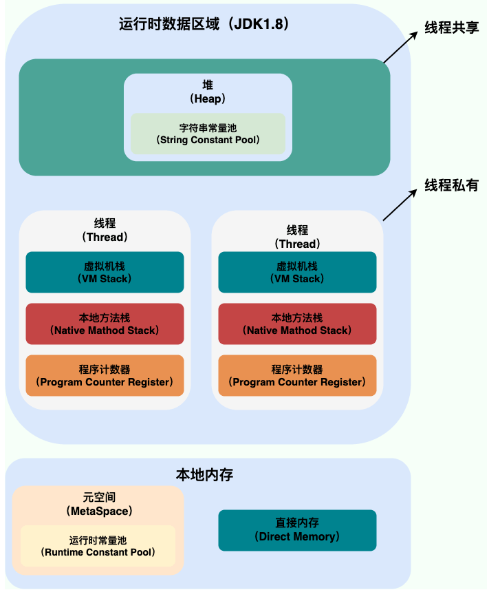
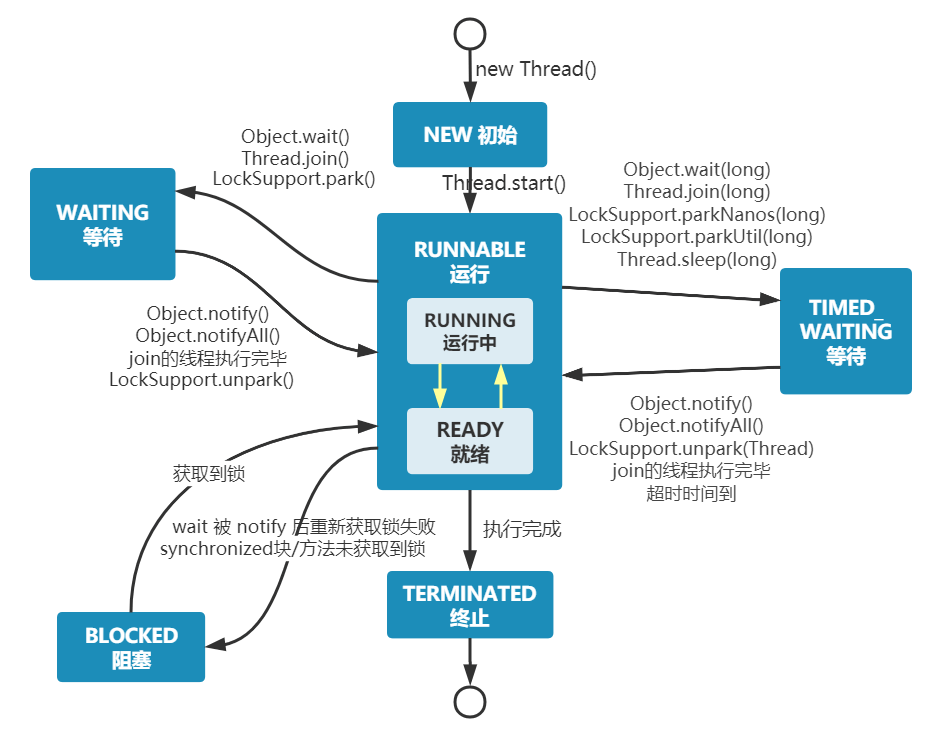

## 进程和线程？

### 何为线程？
进程是程序的一次执行过程，是系统运行进程的基本单位。系统运行一个程序即是进程从创建，到运行，最后消亡的过程。

在 Java 中，当我们启动 main 函数时其实就是启动了一个 JVM 的进程，而 main 函数所在的线程就是这个进程中的一个线程，也称主线程。

### 何为线程？
- 线程与进程相似，但线程是一个比进程更小的执行单位。
- 一个进程可以产生多个线程。
- 线程拥有自己的程序计数器，虚拟机栈和本地方法栈
- 同类的多个线程会共享进程的堆和方法区资源
- 系统产生一个线程或各个线程之前切换工作负担比进程小得多，所以线程也称轻量级进程

### Java线程和操作系统的线程有什么区别？
现在的 Java 线程的本质其实就是操作系统的线程

- 但是在JDK1.2之前，Java线程是基于绿色线程实现的，这是一种用户级线程，不依赖于操作系统，但是会有限制，比如不能使用操作系统提供的异步I/O）
- JDK1.2之后，Java 线程改为基于原生线程（Native Threads）实现，也就是说 JVM 直接使用操作系统原生的内核级线程（内核线程）来实现 Java 线程，由操作系统内核进行线程的调度和管理。

- 用户线程：由用户空间程序管理和调度的线程，运行在用户空间（专门给应用程序使用）。
- 内核线程：由操作系统内核管理和调度的线程，运行在内核空间（只有内核程序可以访问）。
- 用户线程创建和切换成本低，但不可以利用多核。内核态线程，创建和切换成本高，可以利用多核。

场景线程模型：
1.一对一（一个用户线程对应一个内核线程）
2.一对多（一个内核线程对应多个用户线程）
3.多对多（多个用户线程对应多个内核线程）

##### 线程存在于进程的堆和方法区资源，线程有自己的虚拟机栈，本地方法栈，程序计数器

### 程序计数器为什么是私有的?
程序计数器主要有下面两个作用：
1. 字节码解释器通过读取程序计数器来依次读取指令，从而实现代码的流程控制
2. 在多线程的情况下，程序计数器记录当前线程执行的位置，从而线程切换时能恢复到上次执行的状态

需要注意的是，如果执行的是 native 方法，那么程序计数器记录的是 undefined 地址，只有
执行的是 Java 代码时程序计数器记录的才是下一条指令的地址。

### 虚拟机栈和本地方法栈为什么是私有的?
- 虚拟机栈： 每个 Java 方法在执行之前会创建一个栈帧用于存储局部变量表、操作数栈、常量池引用等信息。从方法调用直至执行完成的过程，就对应着一个栈帧在 Java 虚拟机栈中入栈和出栈的过程。
- 本地方法栈： 和虚拟机栈所发挥的作用非常相似，区别是：虚拟机栈为虚拟机执行 Java 方法 （也就是字节码）服务，而本地方法栈则为虚拟机使用到的 Native 方法服务。 在 HotSpot 虚拟机中和 Java 虚拟机栈合二为一。

### 一句话简单了解堆和方法区
堆和方法区是所有线程共享的资源，其中堆是进程中最大的一块内存，主要用于存放新创建的对象 (几乎所有对象都在这里分配内存)，方法区主要用于存放已被加载的类信息、常量、静态变量、即时编译器编译后的代码等数据。

## 并发与并行的区别
- 并发：两个或两个以上的作业在同一时间段执行
- 并行：两个或两个以上的作业在同一时刻执行

## 同步和异步的区别
- 同步：发出一个调用后，在没有得到结果之前，该调用就不可以返回，一直等待
- 异步：调用发出后，不用等待返回结果，该调用直接返回

## 为什么使用多线程？
- 单核：在单核时代多线程主要是为了提高单进程利用 CPU 和 IO 系统的效率。 

- 多核：多核时代多线程主要是为了提高进程利用多核 CPU 的能力。

## 怎么创建线程？
- 继承Thread类
- 实现Runable接口
- 实现Callable接口
- 创建线程池

## 线程的生命周期
- NEW:初始状态，线程被创建处理但还未调用start()
- RUNNABLE:运行状态，线程被调用了start()等待运行的状态
- BLOCKED:阻塞状态，需要等待锁被释放
- WAITING:等待状态，表示线程需要等待其他线程作出一些特定动作(通知或中断)
- TIME_WAITING: 超时等待状态，可以指定时间后自行返回而不是像WATING一直等待
- TERMINATED:终止状态，表示线程已经运行完毕

###### 在操作系统层面，线程有 READY 和 RUNNING 状态；而在 JVM 层面，只能看到 RUNNABLE 状态

## 什么是线程上下文切换?
线程运行时拥有自己的运行条件和状态(也称上下文)，比如程序计数器，和栈信息等。
出现下面情况时，线程会从占用系统CPU状态中退出：
- 主动让出CPU，如调用了sleep(),wait()
- 系统时间片用完，系统要防止一个线程或进程长时间占用CPU，造成其他线程或进程饥饿
- 调用了阻塞类型的系统中断，如请求I/O，线程阻塞等
- 线程结束或被终止

前三种都会发生线程切换，线程切换意味着要保存线程的上下文，等待下次占用CPU时恢复到上次现场。并且要加载下一个将要占用线程的上下文。这就是上下文切换。

## 什么是线程死锁？如何避免死锁？
### 认识线程死锁
产生死锁的四个必要条件：
- 互斥条件：该资源某一时刻只由一个线程占用
- 请求与保持条件：线程因请求资源而阻塞，但是保持已经获得的资源不释放
- 不剥夺条件：线程以获得的资源在未使用之前不能被强行剥夺，直到该线程使用完毕后才释放
- 循环等待条件：若干线程之间形成一种头尾相接的循环等待资源的关系

### 如何预发死锁或避免死锁？
#### 如何预防？
1. 破坏请求并保持条件：一次性申请所有资源
2. 破坏不剥夺条件：占用部分资源的线程进一步申请资源时，如果申请不到就主动释放它占有的资源
3. 破坏循环等待条件：按某一顺序申请资源，释放资源按反序释放

## sleep()和wait()方法对比
共同点:两者都可以暂停线程
不同点：
- sleep()没有释放锁，而wait()释放了锁
- wait()通常用于线程间交互/通信，sleep()通常用于暂停执行
- wait()方法调用后不会自动苏醒，需要别的线程调用同一个对象的notify()或notifyAll()方法。而sleep()方法执行完成后，线程会自动苏醒，或者也可以使用 wait(long timeout) 超时后线程会自动苏醒。
- sleep()是Thread类的静态本地方法，wait()则是Object类的本地方法

## 为什么wait()方法不定义在Thread类中？
- wait() 是让获得对象锁的线程实现等待，会自动释放当前线程占有的对象锁。每个对象（Object）都拥有对象锁，既然要释放当前线程占有的对象锁并让其进入 WAITING 状态，自然是要操作对应的对象（Object）而非当前的线程（Thread）。
- sleep() 是让当前线程暂停执行，不涉及到对象类，也不需要获得对象锁。

## 可以直接调用 Thread 类的 run 方法吗？
- 可以调用run方法，但是这不是多线程的方式执行的，一种在main线程下执行的一个普通方法
- 真正多线程的执行方法是，创建一个线程，new Threa类然后调用start()方法，start()方法会执行线程的准备工作，然后会自动调用run()方法的内容