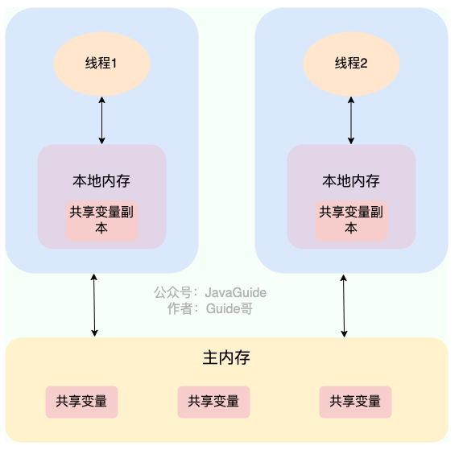

## JMM内存模型
JMM(Java 内存模型)主要定义了对于一个共享变量，当另一个线程对这个共享变量执行写操作后，这个线程对这个共享变量的可见性。

### 什么是JMM(Java 内存模型)？

#### 为什么需要JMM？
- Java是跨平台的，需要自己实现一套内存模型来屏蔽系统差异
- Java从源代码到CPU可执行指令的转换阶段需要遵守哪些和并发相关的原则和规范，其主要目的是为了简化多线程编程，增强程序可移植性的。
- 抽象了线程和主内存之间的关系

> JMM 说白了就是定义了一些规范来解决这些问题，开发者可以利用这些规范更方便地开发多线程程序。对于 Java 开发者说，你不需要了解底层原理，直接使用并发相关的一些关键字和类（比如 volatile、synchronized、各种 Lock）即可开发出并发安全的程序。

#### JMM 是如何抽象线程和主内存之间的关系？
前提: 在 JDK1.2 之前，Java 的内存模型实现总是从 主存 （即共享内存）读取变量，是不需要进行特别的注意的,而现在Java的内存模型，线程可以把变量保存在本地内存中，这样会导致数据不一致问题。

##### 什么是主存什么是本地内存？
- 主内存：所有线程创建的实例对象都存放在主内存中，不管该实例对象是成员变量，还是局部变量，类信息、常量、静态变量都是放在主内存中。为了获取更好的运行速度，虚拟机及硬件系统可能会让工作内存优先存储于寄存器和高速缓存中。
- 本地内存：每个线程都有一个私有的本地内存，本地内存存储了该线程以读 / 写共享变量的副本。每个线程只能操作自己本地内存中的变量，无法直接访问其他线程的本地内存。如果线程间需要通信，必须通过主内存来进行。本地内存是 *JMM 抽象出来的一个概念*，并不真实存在，它涵盖了缓存、写缓冲区、寄存器以及其他的硬件和编译器优化。
- 
线程 1 与线程 2 之间如果要进行通信的话，必须要经历下面 2 个步骤：
1. 线程1把修改过的共享变量副本同步到主内存中去；
2. 线程2到主存读取对应的共享变量的值；

不过，多线程下，对主内存中的一个共享变量进行操作有可能诱发线程安全问题。举个例子：
1. 线程1和线程2同时对主存中同一个共享变量进行操作，一个执行修改，一个执行读取；
2. 线程 2 读取到的是线程 1 修改之前的值还是修改后的值并不确定，都有可能，因为线程 1 和线程 2 都是先将共享变量从主内存拷贝到对应线程的工作内存中。

关于主内存与工作内存直接的具体交互协议，即一个变量如何从主内存拷贝到工作内存，如何从工作内存同步到主内存之间的实现细节，Java 内存模型定义来以下八种同步操作（了解即可，无需死记硬背）：
- 锁定(lock)：
- 解锁(unlock):
- 读取(read):
- 载入(load):
- 使用(use):
- 赋值(assign):
- 存储(store):
- 写入(write):

#### Java 内存区域和 JMM 有何区别？
- JVM 内存结构和 Java 虚拟机的运行时区域相关，定义了 JVM 在运行时如何分区存储程序数据，就比如说堆主要用于存放对象实例。
- Java 内存模型和 Java 的并发编程相关，抽象了线程和主内存之间的关系就比如说线程之间的共享变量必须存储在主内存中，规定了从 Java 源代码到 CPU 可执行指令的这个转化过程要遵守哪些和并发相关的原则和规范，其主要目的是为了简化多线程编程，增强程序可移植性的。


### volatile 关键字(可见性，禁止指令重排序)

#### 如何保证变量的可见性？

在 Java 中，volatile 关键字可以保证变量的可见性，如果我们将变量声明为 volatile ，这就指示 JVM，这个变量是共享且不稳定的，每次使用它都到主存中进行读取。

#### 如何禁止指令重排序

在 Java 中，volatile 关键字除了可以保证变量的可见性，还有一个重要的作用就是防止 JVM 的指令重排序。 如果我们将变量声明为 volatile ，在对这个变量进行读写操作的时候，会通过插入特定的 内存屏障 的方式来禁止指令重排序。

单例模式中双重检验锁方式实现单例模式的原理：
```java
public class Singleton {

    private volatile static Singleton uniqueInstance;

    private Singleton() {
    }

    public  static Singleton getUniqueInstance() {
       //先判断对象是否已经实例过，没有实例化过才进入加锁代码
        if (uniqueInstance == null) {
            //类对象加锁
            synchronized (Singleton.class) {
                if (uniqueInstance == null) {
                    uniqueInstance = new Singleton();
                }
            }
        }
        return uniqueInstance;
    }
}
```
uniqueInstance 采用 volatile 关键字修饰也是很有必要的， uniqueInstance = new Singleton(); 这段代码其实是分为三步执行：
1. 为uniqueInstance分配内存空间
2. 为uniqueInstance初始化
3. 将uniqueInstance指向分配的内存地址

> 但是由于 JVM 具有指令重排的特性，执行顺序有可能变成 1->3->2。指令重排在单线程环境下不会出现问题，但是在多线程环境下会导致一个线程获得还没有初始化的实例。例如，线程 T1 执行了 1 和 3，此时 T2 调用 getUniqueInstance() 后发现 uniqueInstance 不为空，因此返回 uniqueInstance，但此时 uniqueInstance 还未被初始化。


#### volatile 可以保证原子性么？
volatile 关键字能保证变量的可见性，但不能保证对变量的操作是原子性的。
```java
public class VolatileAtomicityDemo {
    public volatile static int inc = 0;

    public void increase() {
        inc++;
    }

    public static void main(String[] args) throws InterruptedException {
        ExecutorService threadPool = Executors.newFixedThreadPool(5);
        VolatileAtomicityDemo volatileAtomicityDemo = new VolatileAtomicityDemo();
        for (int i = 0; i < 5; i++) {
            threadPool.execute(() -> {
                for (int j = 0; j < 500; j++) {
                    volatileAtomicityDemo.increase();
                }
            });
        }
        // 等待1.5秒，保证上面程序执行完成
        Thread.sleep(1500);
        System.out.println(inc);
        threadPool.shutdown();
    }
}
```
正常情况下，运行上面的代码理应输出 2500。但你真正运行了上面的代码之后，你会发现每次输出结果都小于 2500。

很多人会误认为自增操作 inc++ 是原子性的，实际上，inc++ 其实是一个复合操作，包括三步：
1. 读取 inc 的值。
2. 对 inc 加 1。
3. 将 inc 的值写回内存。
volatile 是无法保证这三个操作是具有原子性的，有可能导致下面这种情况出现：
1. 线程 1 对 inc 进行读取操作之后，还未对其进行修改。线程 2 又读取了 inc的值并对其进行修改（+1），再将inc 的值写回内存。
2. 线程 2 操作完毕后，线程 1 对 inc的值进行修改（+1），再将inc 的值写回内存。   
其实，如果想要保证上面的代码运行正确也非常简单，利用 synchronized、Lock或者AtomicInteger都可以。
使用 synchronized 改进：
```java
public synchronized void increase() {
    inc++;
}
```

### 乐观锁和悲观锁
#### 悲观锁
定义：共享资源每次只给一个线程使用，其它线程阻塞，用完后再把资源转让给其它线程。
> 像 Java 中synchronized和ReentrantLock等独占锁就是悲观锁思想的实现。

> 高并发的场景下，激烈的锁竞争会造成线程阻塞，大量阻塞线程会导致系统的上下文切换，增加系统的性能开销。并且，悲观锁还可能会存在死锁问题，影响代码的正常运行。

#### 乐观锁
乐观锁总是假设最好的情况，认为共享资源每次被访问的时候不会出现问题，线程可以不停地执行，无需加锁也无需等待，只是在提交修改的时候去验证对应的资源（也就是数据）是否被其它线程修改了（具体方法可以使用版本号机制或 CAS 算法）。
> 在 Java 中java.util.concurrent.atomic包下面的原子变量类（比如AtomicInteger、LongAdder）就是使用了乐观锁的一种实现方式 CAS 实现

> 高并发的场景下，乐观锁相比悲观锁来说，不存在锁竞争造成线程阻塞，也不会有死锁的问题，在性能上往往会更胜一筹。但是，如果冲突频繁发生（写占比非常多的情况），会频繁失败和重试，这样同样会非常影响性能，导致 CPU 飙升。

#### 理论上选择：
- 悲观锁通常多用于写比较多的情况（多写场景，竞争激烈），这样可以避免频繁失败和重试影响性能，悲观锁的开销是固定的。不过，如果乐观锁解决了频繁失败和重试这个问题的话（比如LongAdder），也是可以考虑使用乐观锁的，要视实际情况而定。
- 乐观锁通常多用于写比较少的情况（多读场景，竞争较少），这样可以避免频繁加锁影响性能。不过，乐观锁主要针对的对象是单个共享变量（参考java.util.concurrent.atomic包下面的原子变量类）。

#### 实现乐观锁的两种算法
##### 1. 版本号机制
一般是在数据表中加上一个数据版本号 version 字段，表示数据被修改的次数。当数据被修改时，version 值会加一。当线程 A 要更新数据值时，在读取数据的同时也会读取 version 值，在提交更新时，若刚才读取到的 version 值为当前数据库中的 version 值相等时才更新，否则重试更新操作，直到更新成功。

例子：
  1. 操作员 A 此时将其读出（ version=1 ），并从其帐户余额中扣除 $50（ $100-$50 ）。
  2. 在操作员 A 操作的过程中，操作员 B 也读入此用户信息（ version=1 ），并从其帐户余额中扣除 $20 （ $100-$20 ）。
  3. 操作员 A 完成了修改工作，将数据版本号（ version=1 ），连同帐户扣除后余额（ balance=$50 ），提交至数据库更新，此时由于提交数据版本等于数据库记录当前版本，数据被更新，数据库记录 version 更新为 2 。
  4. 操作员 B 完成了操作，也将版本号（ version=1 ）试图向数据库提交数据（ balance=$80 ），但此时比对数据库记录版本时发现，操作员 B 提交的数据版本号为 1 ，数据库记录当前版本也为 2 ，不满足 “ 提交版本必须等于当前版本才能执行更新 “ 的乐观锁策略，因此，操作员 B 的提交被驳回。

##### 2. CAS算法
CAS 的全称是 Compare And Swap（比较与交换） ，用于实现乐观锁，被广泛应用于各大框架中。CAS 的思想很简单，就是用一个预期值和要更新的变量值进行比较，两值相等才会进行更新。

CAS 是一个原子操作，底层依赖于一条 CPU 的原子指令。

CAS 涉及到三个操作数：

- V：要更新的变量值(Var)
- E：预期值(Expected)
- N：拟写入的新值(New)

当且仅当 V 的值等于 E 时，CAS 通过原子方式用新值 N 来更新 V 的值。如果不等，说明已经有其它线程更新了 V，则当前线程放弃更新。

例子：线程 A 要修改变量 i 的值为 6，i 原值为 1（V = 1，E=1，N=6，假设不存在 ABA 问题）
- i 与 1 进行比较，如果相等， 则说明没被其他线程修改，可以被设置为 6 。
- i 与 1 进行比较，如果不相等，则说明被其他线程修改，当前线程放弃更新，CAS 操作失败

###### CAS算法的弊端：
- ABA问题：
    > 如果一个变量 V 初次读取的时候是 A 值，并且在准备赋值的时候检查到它仍然是 A 值，但是中间可能被其他线程更改过但是又改回A值了

    > ABA 问题的解决思路是在变量前面追加上版本号或者时间戳。JDK 1.5 以后的 AtomicStampedReference 类就是用来解决 ABA 问题的，其中的 compareAndSet() 方法就是首先检查当前引用是否等于预期引用，并且当前标志是否等于预期标志，如果全部相等，则以原子方式将该引用和该标志的值设置为给定的更新值。
- 循环时间长开销大:
    > CAS 经常会用到自旋操作来进行重试，也就是不成功就一直循环执行直到成功。如果长时间不成功，会给 CPU 带来非常大的执行开销。

    > 如果 JVM 能支持处理器提供的 pause 指令那么效率会有一定的提升，pause 指令有两个作用：

        - 可以延迟流水线执行指令，使 CPU 不会消耗过多的执行资源，延迟的时间取决于具体实现的版本，在一些处理器上延迟时间是零。
        - 可以避免在退出循环的时候因内存顺序冲突而引起 CPU 流水线被清空，从而提高 CPU 的执行效率。
        只能保证一个共享变量的原子操作

- 只能保证一个共享变量的原子操作
  > CAS 只对单个共享变量有效，当操作涉及跨多个共享变量时 CAS 无效,在JDK1.5开始，提供AtomicReference类保证引用对象之间的原子性。

### synchronized 关键字
synchronized 是 Java 中的一个关键字，翻译成中文是同步的意思，主要解决的是多个线程之间访问资源的同步性，可以保证被它修饰的方法或者代码块在任意时刻只能有一个线程执行。

###### 备注：早期Java中synchronized是重量级锁，效率低下； Java 6 之后，优化让 synchronized 锁的效率提升了很多

#### 如何使用synchronized？
- 修饰实例方法
给当前对象实例加锁，进入同步代码前要获得 当前对象实例的锁 。
```java
synchronized void method() {
    //业务代码
}
```
- 修饰静态方法
    给当前类加锁，会作用于类的所有对象实例 ，进入同步代码前要获得 当前 class 的锁。


    这是因为静态成员不属于任何一个实例对象，归整个类所有，不依赖于类的特定实例，被类的所有实例共享。
```java
synchronized static void method() {
    //业务代码
}
```

- 修饰代码块

对括号里指定的对象/类加锁：
 - synchronized(object) 表示进入同步代码库前要获得 给定对象的锁。
 - synchronized(类.class) 表示进入同步代码前要获得 给定 Class 的锁
```java
synchronized(this) {
    //业务代码
}
```

#### synchronized底层原理
在修饰同步语句块的时候，使用的是monitorenter和monitorexit指令，这两个指令分别对应于进入和退出同步代码块的入口。
- 执行monitorenter时，会获取对象的锁，如果锁计数器表示为0，则表明锁可以被获取
- 执行monitorexit时，只有锁的拥有者线程才能释放锁，把锁计数器设为0，表明锁被释放

在修饰方法时，使用的是ACC_SYNCHRONIZED标识符，表面该方法是一个同步方法，JVM通过该标识来辨别是否是一个同步方法，从而执行相应的同步调用
如果修饰的是一个实例方法，则会获取该实例对象的锁，如果是修饰静态方法，则会获取当前class的锁

#### synchronized 与 volatile的区别？
- volatile 关键字是线程轻量级同步实现，所以性能会比synchronized关键字好，但是valatile只能修饰变量，而synchronized可以修饰方法和代码块
- valatile只能保证数据可见性，而不能保证原子性，但是synchronized两者都能保证
- valatile关键字主要用于解决多个线程之间的可见性，而synchronized关键字主要用于解决多个线程之间访问资源的同步性。


### ReentrantLock

#### ReentrantLock是什么？
ReentrantLock，字面上是可重入锁的意思，它实现了Lock接口，与synchronized类似，但是更灵活、强大，增加了轮询，超时、中断、公平锁和非公平锁等高级功能

ReentrantLock里面有一个内部类，Sync，Sync继承于 AQS(AbstractQueuedSynchronizer),添加和释放锁大部分操作实际上都是在Sync中完成的，Sync有FairSync公平锁和NonfairSync非公平锁两个子类,ReentrantLock默认是非公平锁。

```java
// 传入一个 boolean 值，true 时为公平锁，false 时为非公平锁
public ReentrantLock(boolean fair) {
    sync = fair ? new FairSync() : new NonfairSync();
}
```

#### 什么是公平锁和非公平锁？
公平锁：锁释放之后，按时间申请锁的先后顺序来得到锁，性能会较差，出现线程频繁的问题
非公平锁：所释放之后，后申请的线程可能会获取锁，是随机或按照其他优先级排序的，性能更换，但是会出现线程饥饿问题


#### Synchronize和ReentrantLock的区别?
共同点：两者都是*可重入锁*

什么是可重入锁，可重入锁就是同一个线程在获得某个锁之后，在该线程释放锁之前，可以再次获得该锁而不被阻塞。
```java
public class SynchronizedDemo {
    public synchronized void method1() {
        System.out.println("方法1");
        method2();
    }

    public synchronized void method2() {
        System.out.println("方法2");
    }
}

```