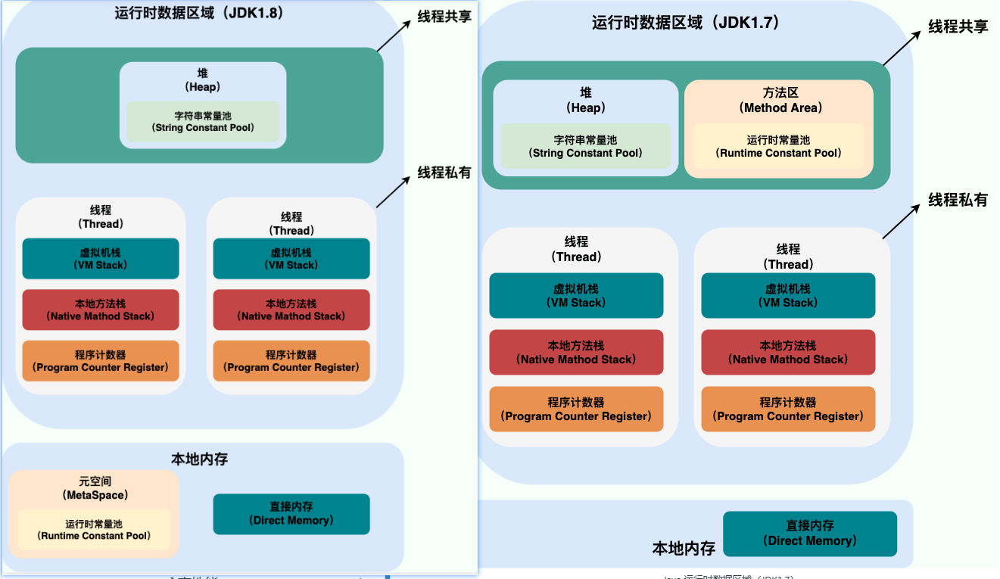
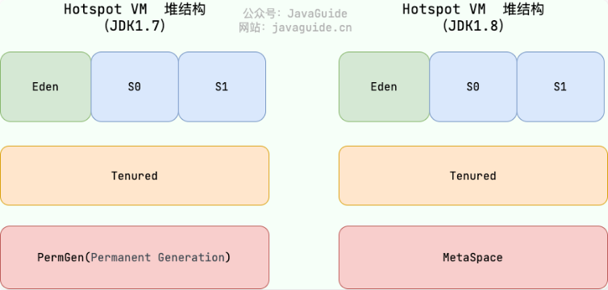
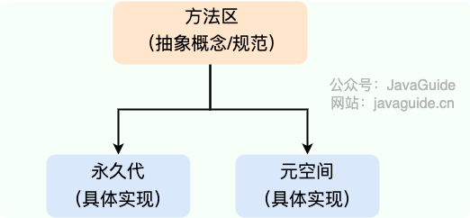

## 运行时数据区域
Java虚拟机会在运行时把它管理的内存划分为若干个不同的区域
JDK1.7与JDK1.8：

可以看出Java内存区域有三大部分，分别是：
1. 线程共享部分：
   - 在1.7中，线程共享部分，有堆，字符串常量池，方法区，和运行时常量池
   - 在1.8中，线程共享部分，只剩下堆，字符串常量池
2. 线程私有部分：
   - 虚拟机栈：简称栈，栈空间是线程独有的，
   - 本地方法栈：与虚拟机栈类似，只不过是为native方法服务的
   - 程序计数器：记录当前线程的执行位置，以便上下文切换
3. 本地内存部分：
   - 直接内存：
   - 在1.8中加入了元空间，且运行时常量池也放入了本地内存

### 程序计数器
主要是两个功能：
- 可以看作是当前字节码执行的行号指示器，字节码解释器通过改变程序计数器来执行下一条字节码指令，实现代码的流程控制
- 在多线程情况下，程序计数器记录当前线程执行到的位置，在线程切换回来的时候能够知道上一次运行到哪里

### Java虚拟机栈
每个线程都有自己的栈，生命周期和线程相同，随线程创建而创建，线程消亡而消亡。
栈由一个个栈帧组成，栈帧的组成是
- 局部变量表：存放编译期可知的基本数据类型(byte,char,boolean,short,int,long,float,double)、对象引用(就是指向实例化对象的内存的指针)
- 操作数栈：作为方法调用的中转站，存放方法执行过程中产生的中间计算结果
- 动态链接：将调用的方法的符合引用(方法名)转换为直接引用(内存地址)
- 方法返回地址：方法执行完毕之后，回到调用该方法的位置，一般有两种方法结束方式：正常返回和异常返回

上面是一个栈帧的组成，Java每次调用方法都会创建一个栈帧，压入虚拟机栈，方法执行完毕，栈帧出栈。

栈可能会出现两种运行错误：
- StackOverflowError: 不允许栈内存动态扩展时，当前线程创建的栈帧请求超过了栈最大深度
- OutOfMemoryError: 允许栈内存动态扩展时，栈扩展时无法申请到足够的内存

### 本地方法栈

与Java虚拟机栈类似，区别是创建Native方法时才创建栈帧，在HopSpot中虚拟机栈和本地方法栈合二为一

### 堆
目的是为了存放对象实例，几乎所有的对象实例以及数组都在堆上分配内存。
Java堆是线程共享的，在虚拟机启动时创建，由垃圾收集器管理，也称GC堆

1.7之前是永久代，1.8之后由元空间所替代，先介绍新生代内存，老生代，永久代放到元空间对比：
- 新生代内存：包含三个部分，Eden，S0，S1
- 老年代：一般到15岁时晋升到老年代
- 永久代和元空间

### 方法区
方法区会存储已被虚拟机加载的类信息，字段信息，静态变量，常量，方法信息，即时编译器编译后的代码缓存

方法区是一个Java虚拟机的逻辑区域，而永久代和元空间是方法区的两种实现

#### 元空间为什么替代了永久代？
- 整个永久代有Java虚拟机设置固定的最大内存空间，无法进行调整，而元空间使用的是本地内存，受本地机器的内存影响，虽然仍可能溢出，但是几率变低。
- 元空间存放的是类的元数据，这样加载多少类的元数据就不由 MaxPermSize 控制了, 而由系统的实际可用空间来控制，这样能加载的类就更多了
- 在 JDK8，合并 HotSpot 和 JRockit 的代码时, JRockit 从来没有一个叫永久代的东西, 合并之后就没有必要额外的设置这么一个永久代的地方了。

### 运行时常量池
字符串常量池数据：
1. 字面量: 文本字符串，数字，就是变量值

2. 符号引用：就是指向数值的引用，类似于指针

3. 其他元数据：类的继承关系，接口实现，类的结构等

### 字符串常量池
字符串常量池 是 JVM 为了提升性能和减少内存消耗针对字符串（String 类）专门开辟的一块区域，主要目的是为了避免字符串的重复创建。

字符串常量池会把如"Hello World"这样的字符串保存在池中，当再次创建相同的字符串时，只需要返回该字符串的引用，不用创建新的对象

在1.7之前，字符串常量池是放在永久代的，1.7之后，字符串常量池被移到堆中，并由垃圾收集器管理。

### 直接内存

是Java虚拟机中特殊的内存缓冲区，并不在Java堆或方法区中分配内存，而是通过NIO的方式在本地内存中分配的

申请到的内存，通过存储在Java堆中的DirectByteBuffer对象进行操作，可以直接操作系统内存，避免了Java堆和Native堆之间的复制操作，提高了性能。

## HopSpot虚拟机对象

创建对象过程：
1. 类加载检查
虚拟机遇到一条new命令后，会去常量池中检查是否有该类的符号引用，并检查该符号引用的类是否被加载、解析和初始化过，如果没有则执行类加载过程

2. 分配内存
在通过类分配检查之后，会为新生对象分配内存。对象所需要的内存大小，在类加载完成后便可确定，即把一块确定大小的内存空间从Java堆中划分出来。分配内存有两种方式，而使用哪种方式又是由垃圾收集器是否带有压缩整理功能决定。

两种方式分别是：
- 指针碰撞：适用于内存规整的情况，原理是内存分为两块，没有用过的内存放在另外一边，中间有一个分界指针，分配时只需要将指针向空闲内存区移动对象内存大小即可
- 空闲列表：适用于内存不规整的情况，原理是虚拟机会维护一个列表，记录哪些内存块是可用的，分配的时候找一块大的内存块来划分给对象实例

除了分配问题，创建对象是一件频繁发生的事情，虚拟机要保证线程是安全的，这会导致并发问题。
解决方法：
- CAS + 失败重试：CAS就是compareAndSet，是一种乐观锁，对比当前内存值和旧的期望值，如果相同则更新内存值，否则失败重试
- TLAB：虚拟机首先为每个线程预先在堆中的Eden中分配一块内存（TLAB），JVM在给对象分配内存时，首先在TLAB中分配，当分配的对象大于TLAB的剩余内存时，再采用CAS进行内存分配。

3. 初始化零值
分配完内存之后，虚拟机会对分配内存的对象进行初始化，即把对象中的字段赋予初始值。

4. 设置对象头
初始化零值完成后，虚拟机要对对象进行

5. 执行init方法
把对象按照程序员的要求初始化，默认值，或者调用构造函数来完成初始化。

### 对象的内存布局
- 对象头：也包含两部分信息，第一部分是存储对象自身的运行数据(哈希码、GC分代年龄、锁状态等)，第二部分是类型指针，指向它的类元数据
- 实例数据：对象真正存储的有效信息
- 对齐填充：占位作用，对象大小必须为8字节的整数倍，因此需要对齐填充

### 对象的访问定位
通过栈上的局部变量表中的reference数据来操作堆上的具体对象
对象的访问方式由虚拟机实现而定，目前主流的访问方式有：使用句柄、直接指针

- 使用句柄：使用句柄来访问对象，句柄中包含了对象实例数据在堆中的具体地址，通过句柄来访问对象，可以避免直接访问堆内存，减少一次指针定位的时间开销。

- 直接指针：直接指针就是直接指向对象实例数据在堆中的地址，通过直接指针来访问对象，速度快，但需要注意指针的有效性，避免出现野指针。

这两种对象访问方式各有优势。使用句柄来访问的最大好处是 reference 中存储的是稳定的句柄地址，在对象被移动时只会改变句柄中的实例数据指针，而 reference 本身不需要修改。使用直接指针访问方式最大的好处就是速度快，它节省了一次指针定位的时间开销。

