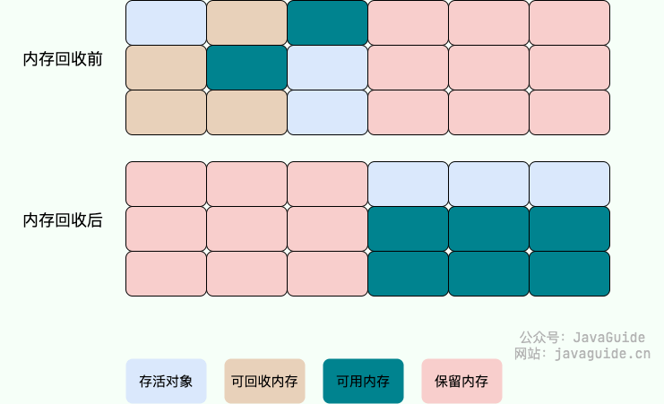

## 内存分配和回收原则

### 对象优先在Eden分配

- 新创建的对象优先在Eden分配，如果Eden没有足够空间，虚拟机将发起一次Minor GC。
- Minor GC发生时，虚拟机将暂停所有应用线程，并将存活的对象复制到Survivor区，然后清理掉Eden和Survivor区，让Eden区变成空闲区。
- 复制过程：将Eden区中存活的对象复制到Survivor区，如果Survivor区没有足够空间容纳这些对象，则将这些对象直接存入老年代。

### 大对象直接进入老年代
大对象是指需要大量连续空间的对象，如字符串、数组等

何时进入老年代，是根据垃圾回收器和相关参数决定的，这是一种优化策略，避免频繁的Minor GC

### 长期存活的对象将进入老年代
在新生代的对象每经过一次Minor GC之后，仍存活下来的，就会被移动到Survivor区(S0或S1),HotSpot会遍历所有的对象，按照年龄从小到大进行累计，累计到某个年龄超过了Survivor区的50%就会移入老年代

### 主要进行的GC区域
两大类GC：
- 部分GC（Partial GC）
    1. 新生代收集（Minor GC / Young GC）：只对新生代进行垃圾收集
    2. 老年代收集（Major GC / Old GC）：只对老年代进行垃圾收集
    3. 混合收集（Mixed GC）：对整个新生代和部分老年代进行垃圾收集
   
- 整堆收集：
    1. 整堆收集（Full GC）：收集整个 Java 堆和方法区。

### 空间分配担保
空间分配担保是为了确保在 Minor GC 之前老年代本身还有容纳新生代所有对象的剩余空间

只要老年代的连续空间大于新生代对象总大小或者历次晋升的平均大小，就会进行 Minor GC，否则将进行 Full GC

### 死亡对象判断方法
堆中几乎放着所有的对象实例，对堆垃圾回收前的第一步就是要判断哪些对象已经死亡（即不能再被任何途径使用的对象）

- 引用计数法：给对象中添加一个引用计数器，每当有一个地方引用它时，计数器加1；当引用失效时，计数器减1；任何时刻计数器为0的对象就是不可能再被使用的。缺点是循环引用的问题。

- 可达性分析法：
以GC ROOTs对象作为起点，从这些节点开始向下搜索，节点走过的路径称为引用链，当一个对象没有与任何一条引用链相连接，则证明此对象是不可达的，需要被回收。

可作为GC Roots的对象是？
- 虚拟机栈中的对象：
- 本地方法栈(Native方法)中引用的对象
- 方法区中类静态变量的引用的对象
- 方法区中常量引用的对象
- 所有被同步锁持有的对象
- JNI(Java Native Interface)引用的对象

### 引用类型总结
JDK1.2之前，reference类型的数据存储的数值是另外一块内存的起始地址就称为引用
JDK1.2之后，分为四种类型强引用、软引用、弱引用、虚引用四种（引用强度逐渐减弱）

- 强引用：普遍的引用方式，垃圾回收绝不会回收它
- 软引用：可有可无，内存空间不足时就会回收
- 弱引用：可有可无，只要被垃圾回收器扫描到就会被回收，不管内存空间足不足够
- 虚引用：虚引用并不会决定对象的生命周期。如果一个对象仅持有虚引用，那么它就和没有任何引用一样，在任何时候都可能被垃圾回收。（要和ReferenceQueue配合使用）

### 如何判断一个常量是否是废弃常量？
假如在字符串常量池中存在字符串 "abc"，如果当前没有任何 String 对象引用该字符串常量的话，就说明常量 "abc" 就是废弃常量，如果这时发生内存回收的话而且有必要的话，"abc" 就会被系统清理出常量池了。

### 如何判断一个类是一个无用的类？
同时满足以下三个条件：
- 该类所有实例已经被回收，Java堆中不存在该类的任何实例
- 加载该类的 ClassLoader已经被回收
- 该类对应的 java.lang.Class 对象没有在任何地方被引用，无法在任何地方通过反射访问该类

### 垃圾收集算法

#### 标记-清除算法
- 标记阶段：首先标记出所有需要回收的对象，标记完成后，统一回收所有被标记的对象。
- 清除阶段：清除所有被标记的对象，释放它们所占用的内存空间。

出现的两个问题：
- 效率问题：标记和清除两个阶段的效率都不高
- 空间问题：标记清除后会出现内存碎片问题

#### 复制算法
为了解决标记清除后出现的内存碎片问题
将内存分为大小相等的两部分，每次使用其中一块，当这一块内存使用完，就清理该内存块的对象，并将还存活的对象复制去另外一块内存，再把使用的空间一次清理掉

出现的两个问题：
- 可用内存空间变小：只使用内存空间的一半
- 不适合于老年代：老年代对象一般比较大，复制性能会变得很差

#### 标记-整理算法
这是一种根据老年代特点而提出的算法
前面步骤和标记-清理算法一致，但是最后不是直接清理，而是将所有存活对象向一端移动，然后将边界以外的内存全部回收。

出现的问题：
- 因为多了整理这一步，所以效率不高，但时候老年代这种垃圾回收频率不高的场景

### 分代收集算法
就是根据不同存活周期划分不同的区域，根据不同区域选择适合的垃圾回收算法
新生代：一般使用复制算法，因为新生代对象一般都比较小，且每次收集都会有大量对象死去
老年代：一般使用标记-整理或标记-清理算法，老年代的对象存活几率是比较高的，而且没有额外的空间对它进行分配担保

### 垃圾收集器

#### 1. Serial收集器

#### 2. ParNew收集器

#### 3. Parallel Scavenge收集器

#### 4.Serial Old收集器

#### 5. Parallel Old收集器

#### 6. CMS收集器

#### 7.G1收集器

#### 8.ZGC收集器