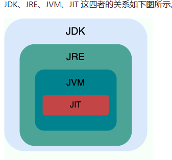
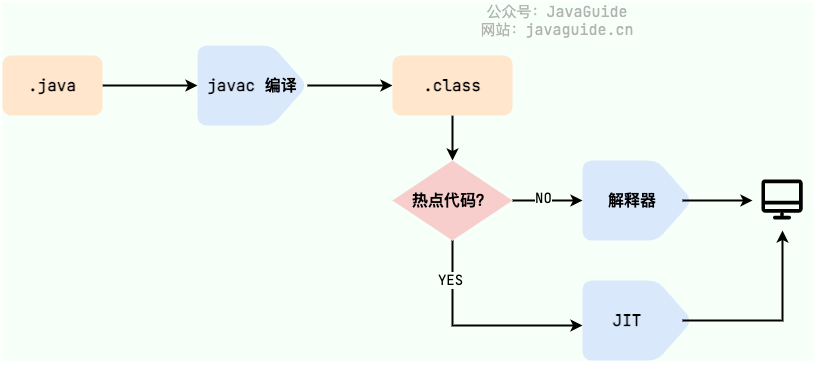
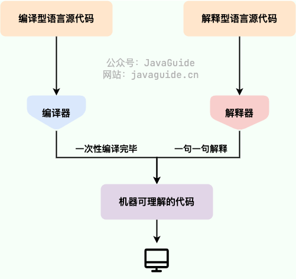

# 1. Java SE和Java EE
- Java SE: java标准版
- Java EE：java企业版

# 2. JVM、JDK、JRE

## 2.1 JDK
全称：Java Development Kit
作用：它是功能齐全的 Java SDK，是提供给开发者使用，能够创建和编译 Java 程序的开发套件。它包含了 JRE，同时还包含了编译 java 源码的编译器 javac 以及一些其他工具比如 javadoc（文档注释工具）、jdb（调试器）、jconsole（基于 JMX 的可视化监控⼯具）、javap（反编译工具）等等。

## 2.2 JRE
全称：Java Run Environment
作用： 是 Java 运行时环境。它是运行已编译 Java 程序所需的所有内容的集合，主要包括 Java 虚拟机（JVM）、Java 基础类库（Class Library）。

## 2.3 JVM
全称：Java Virtual Machine
作用：运行Java字节码的虚拟机
###### JVM 并不是只有一种！只要满足 JVM 规范，每个公司、组织或者个人都可以开发自己的专属 JVM。

## 其他
从 JDK 9 开始，就不需要区分 JDK 和 JRE 的关系了，取而代之的是模块系统（JDK 被重新组织成 94 个模块）+ jlink 工具（随 Java 9 一起发布的新命令行工具，用于生成自定义 Java 运行时映像，该映像仅包含给定应用程序所需的模块）。并且，从 JDK 11 开始，Oracle 不再提供单独的 JRE 下载。

# 3.字节码
定义：.class文件，只面向虚拟机，解决解释型语言效率低问题，保留解释型语言可移植特点

热点代码处理：运行时编译。当 JIT 编译器完成第一次编译后，其会将字节码对应的机器码保存下来，下次可以直接使用

# 4. 编译型和解释型
- 编译型：源代码编译成机器码，C，C++
- 解释型：源代码解释成机器码，Python,JavaScript
- 编译与解释并存：源代码先编译成字节码，后解释成机器码，Java

# AOT和JIT编译模式
- AOT：程序运行之前将源代码一次性地编译成机器码的过程
- JIT：程序运行时将源代码逐行或逐段地编译成机器码的过程

- AOT优势：启动时机，内存占用，打包体积 （云原生场景，对微服务架构）
- JIT优势：更高的极限处理能力，降低请求的最大延迟 （动态特性，如反射、动态代理、动态加载）

