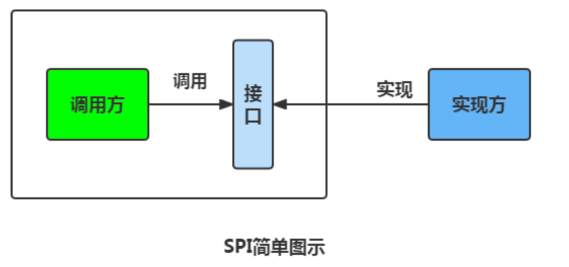
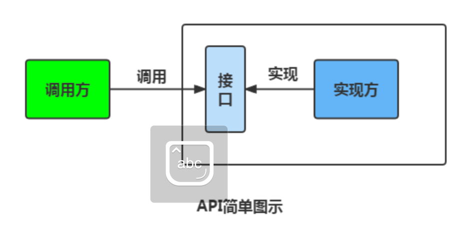

# 什么时SPI？
定义：Service Provider interface，
专门提供给服务提供者或者扩展框架功能的开发者去使用的一个接口

# SPI和API的区别是什么？
SPI:调用方定义接口规则，实现接口方按规则实现

API:实现方实现接口，调用方调用接口

# SPI优缺点
优点：大大地提高接口设计的灵活性
缺点：
- 需要遍历加载所有的实现类，不能做到按需加载，这样效率还是相对较低的。
- 当多个 ServiceLoader 同时 load 时，会有并发问题。

# 序列化和反序列化

简单来说：
- 序列化：将数据结构或对象转换成二进制字节流的过程
- 反序列化：将序列化过程中生成的二进制字节流转换为数据结构或对象的过程

###### 序列化的主要目的是通过网络传输对象或者说是将对象存储到文件系统、数据库、内存中。

## 序列化协议对应于 TCP/IP 4 层模型的哪一层？

如上图所示，OSI 七层协议模型中，表示层做的事情主要就是对应用层的用户数据进行处理转换为二进制流。反过来的话，就是将二进制流转换成应用层的用户数据。这不就对应的是序列化和反序列化么？

因为，OSI 七层协议模型中的应用层、表示层和会话层对应的都是 TCP/IP 四层模型中的应用层，所以序列化协议属于 TCP/IP 协议应用层的一部分。

## 如果有些字段不想进行序列化怎么办？
1. 用transient关键字修饰
2. transient作用：阻止实例中那些用此关键字修饰的的变量序列化；当对象被反序列化时，被 transient 修饰的变量值不会被持久化和恢复。
3. 注意：
   - 只能修饰变量
   - 修饰的变量，反序列化后变量值会变为默认值
   - static修饰的变量，不会被序列化，因为不属于任何对象(Object)

## 常见序列化协议有哪些？
JDK 自带的序列化方式一般不会用 ，因为序列化效率低并且存在安全问题。比较常用的序列化协议有 Hessian、Kryo、Protobuf、ProtoStuff，这些都是基于二进制的序列化协议。

像 JSON 和 XML 这种属于文本类序列化方式。虽然可读性比较好，但是性能较差，一般不会选择。

## 为什么不推荐使用 JDK 自带的序列化？
我们很少或者说几乎不会直接使用 JDK 自带的序列化方式，主要原因有下面这些原因：
- 不支持跨语言调用
- 性能差
- 存在安全问题