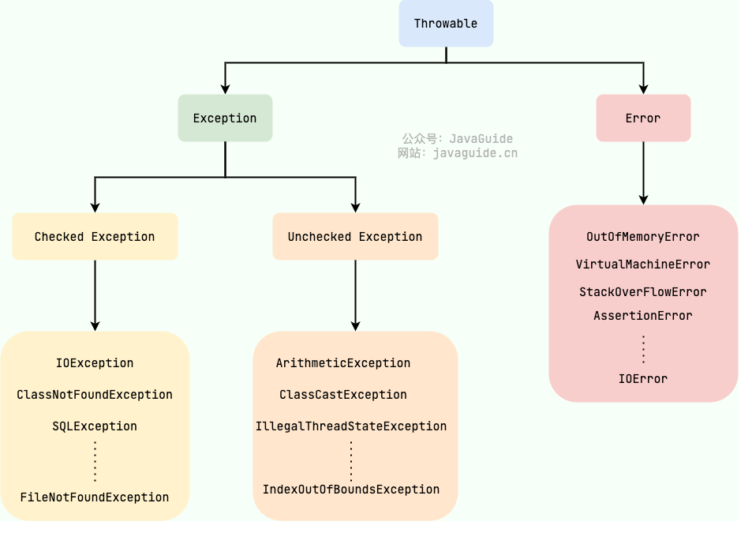

# 1.异常
###### Java 异常类层次结构图概览：


## 1.1 Exception 和 Error 有什么区别？
都是Throwable的子类：
- Exception：程序本身可以处理的异常，可以通过 catch 来进行捕获
- Error：Error 属于程序无法处理的错误 ，不建议通过catch捕获

## 1.2 Checked Exception 和 Unchecked Exception 有什么区别？
- Checked Exception：受检查异常，Java 代码在编译过程中，如果受检查异常没有被 catch或者throws 关键字处理的话，就没办法通过编译。
- UnChecked Exception：不受检查异常 ，Java 代码在编译过程中 ，我们即使不处理不受检查异常也可以正常通过编译。
    - NullPointerException(空指针错误)
    - IllegalArgumentException(参数错误比如方法入参类型错误)
    - NumberFormatException（字符串转换为数字格式错误，IllegalArgumentException的子类）
    - ArrayIndexOutOfBoundsException（数组越界错误）
    - ClassCastException（类型转换错误）
    - ArithmeticException（算术错误）
    - SecurityException （安全错误比如权限不够）
    - UnsupportedOperationException(不支持的操作错误比如重复创建同一用户)

## 1.3 Throwable 类常用方法有哪些？
- String getMessage(): 返回异常发生时的简要描述
- String toString(): 返回异常发生时的详细信息
- String getLocalizedMessage(): 返回异常对象的本地化信息。使用 Throwable 的子类覆盖这个方法，可以生成本地化信息。如果子类没有覆盖该方法，则该方法返回的信息与 getMessage()返回的结果相同
- void printStackTrace(): 在控制台上打印 Throwable 对象封装的异常信息

## 1.4 try-catch-finally 如何使用？
- try块：用于捕获异常。其后可接零个或多个 catch 块，如果没有 catch 块，则必须跟一个 finally 块。
- catch块： 用于处理 try 捕获到的异常。
- finally块：无论是否捕获或处理异常，finally 块里的语句都会被执行。当在 try 块或 catch 块中遇到 return 语句时，finally 语句块将在方法返回之前被执行。

###### 注意：不要在 finally 语句块中使用 return! 当 try 语句和 finally 语句中都有 return 语句时，try 语句块中的 return 语句会被忽略。这是因为 try 语句中的 return 返回值会先被暂存在一个本地变量中，当执行到 finally 语句中的 return 之后，这个本地变量的值就变为了 finally 语句中的 return 返回值。

例子：
```java
public static void main(String[] args) {
    System.out.println(f(2));
}

public static int f(int value) {
    try {
        return value * value;
    } finally {
        if (value == 2) {
            return 0;
        }
    }
}
```
输出：
> 0

# 1.5 finally 中的代码一定会执行吗？
不一定，比如：
- finally 之前虚拟机被终止运行的话
- 程序所处线程死亡
- 关闭了CPU