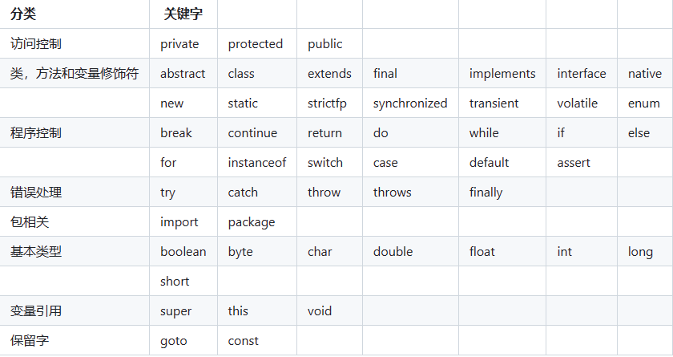
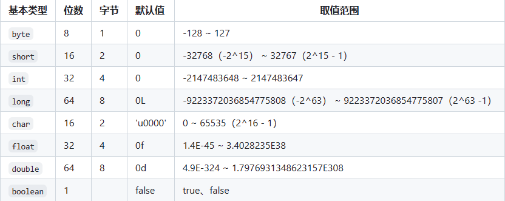
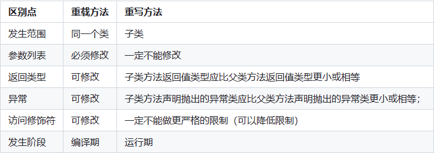

# 1.注释：
- 单行：通常用于解释方法内某单行代码的作用。
```java
// 单行注释
```
- 多行：通常用于解释一段代码的作用。
```java
/* 多行*/
```
- 文档：通常用于生成 Java 开发文档。 
```java
/**
     * @author 作者
     * @param 参数
     * @return 返回值
     */
```

# 2.标识符和关键字
- 标识符：人为取得名字
- 关键字：Java语法关键字（所有的关键字都是小写的）
- 

# 3.自增自减运算符
a++(--)和++(--)a区别

- a++: 先读取a原值，再自增
- ++a：先自增，再读取自增后的值

# 4.移位运算符
前提：操作的数据被视为二进制数，移位就是将其向左或向右移动若干位的运算

三种移位运算符
- 左移<<: 向左移若干位，高位丢弃，低位补零。x << 1,相当于 x 乘以 2(不溢出的情况下)。
- 带符号右移>>： 向右移若干位，高位补符号位，低位丢弃。正数高位补 0,负数高位补 1。x >> 1,相当于 x 除以 2。
- 无符号右移>>>：忽略符号位，空位都以 0 补齐。

    ```java
    int x = -10; // 负数 -10 的二进制表示为 11111111111111111111111111110110
    int result = x >>> 2; // 对 -10 进行无符号右移两位

    System.out.println("Original number: " + x);
    System.out.println("Number after unsigned right shift by 2: " + result);
    ```
    结果是：
    > Original number: -10
    Number after unsigned right shift by 2: 1073741821

如果移位的位数超过数值所占有的位数会怎样？

> 当 int 类型左移/右移位数大于等于 32 位操作时，会先求余（%）后再进行左移/右移操作。也就是说左移/右移 32 位相当于不进行移位操作（32%32=0），左移/右移 42 位相当于左移/右移 10 位（42%32=10）。当 long 类型进行左移/右移操作时，由于 long 对应的二进制是 64 位，因此求余操作的基数也变成了 64。

> 也就是说：x<<42等同于x<<10，x>>42等同于x>>10，x >>>42等同于x >>> 10。

# 5. 基本数据类型

- 6种数字类型：
  - 4种整数型：byte、short、int、long
  - 2种浮点型：float、double
- 1种字符型：char
- 1种布尔型：boolean



> 像 byte、short、int、long能表示的最大正数都减 1 了。这是为什么呢？这是因为在二进制补码表示法中，最高位是用来表示符号的（0 表示正数，1 表示负数），其余位表示数值部分。所以，如果我们要表示最大的正数，我们需要把除了最高位之外的所有位都设为 1。如果我们再加 1，就会导致溢出，变成一个负数。

注意:
  - Java 里使用 long 类型的数据一定要在数值后面加上 L，否则将作为整型解析。
  - char a = 'h'char :单引号，String a = "hello" :双引号。

# 6. 基本类型和包装类型的区别？
> 这八种基本类型都有对应的包装类分别为：Byte、Short、Integer、Long、Float、Double、Character、Boolean 。

- 用途：除了定义一些常量和局部变量之外，很少使用基本类型，包装类型可以用于泛型，而基本类型不可以
- 存储方式：基本数据类型的*局部变量*存放在Java虚拟机栈中的局部变量表中，基本数据类型的*成员变量*存放在Java虚拟机的堆中，包装类型属于对象属性，几乎所有对象实例都在于堆中
- 占用空间：基本数据类型占用空间往往非常小，相较于包装类型
- 默认值：成员变量包装类型不赋值就是null，而基本数据类型有默认值且不是null
- 比较方式：基本数据类型，==比较的是值，对于包装类型，==比较的是对象的内存地址，一般使用equals()方法
```java
public class Test {
    // 成员变量，存放在堆中
    int a = 10;
    // 被 static 修饰，也存放在堆中，但属于类，不属于对象
    // JDK1.7 静态变量从永久代移动了 Java 堆中
    static int b = 20;

    public void method() {
        // 局部变量，存放在栈中
        int c = 30;
        static int d = 40; // 编译错误，不能在方法中使用 static 修饰局部变量
    }
}
```

# 7. 包装类型的缓存机制了解么？
Byte、Short、Integer、Long四种包装类型默认创建了数值[-128,127]相应类型的缓存数据，Charactor创建了数值在[0,127]范围的缓存数据，Boolean直接返回True和false
##### Integer缓存源码：
```java
public static Integer valueOf(int i) {
    if (i >= IntegerCache.low && i <= IntegerCache.high)
        return IntegerCache.cache[i + (-IntegerCache.low)];
    return new Integer(i); //创建新的对象 不在缓存范围内的话
}
private static class IntegerCache {
    static final int low = -128;
    static final int high;
    static {
        // high value may be configured by property
        int h = 127;
    }
}
```

> 下面我们来看一个问题：下面的代码的输出结果是 true 还是 false 呢？
```java
Integer i1 = 40;
Integer i2 = new Integer(40);
System.out.println(i1==i2);
```
> Integer i1=40 这一行代码会发生装箱，也就是说这行代码等价于 Integer i1=Integer.valueOf(40) 。因此，i1 直接使用的是缓存中的对象。而Integer i2 = new Integer(40) 会直接创建新的对象。答案是false，==比较的是地址


# 8. 自动装箱与拆箱原理？
- 装箱：将基本类型用它们对应的引用类型包装起来
```java
Integer i = 10;  //装箱
```
- 拆箱: 将包装类型转换为基本数据类型
```java
int n = i;   //拆箱
```

# 9.浮点数运算精度丢失风险
浮点数运算精度丢失代码演示：
```java
float a = 2.0f - 1.9f;
float b = 1.8f - 1.7f;
System.out.println(a);// 0.100000024
System.out.println(b);// 0.099999905
System.out.println(a == b);// false
```
就比如说十进制下的 0.2 就没办法精确转换成二进制小数：
```java
// 0.2 转换为二进制数的过程为，不断乘以 2，直到不存在小数为止，
// 在这个计算过程中，得到的整数部分从上到下排列就是二进制的结果。
0.2 * 2 = 0.4 -> 0
0.4 * 2 = 0.8 -> 0
0.8 * 2 = 1.6 -> 1
0.6 * 2 = 1.2 -> 1
0.2 * 2 = 0.4 -> 0（发生循环）
...
```

解决方法：
BigDecimal 可以实现对浮点数的运算，不会造成精度丢失。通常情况下，大部分需要浮点数精确运算结果的业务场景（比如涉及到钱的场景）都是通过 BigDecimal 来做的。
```java
BigDecimal a = new BigDecimal("1.0");
BigDecimal b = new BigDecimal("0.9");
BigDecimal c = new BigDecimal("0.8");

BigDecimal x = a.subtract(b);
BigDecimal y = b.subtract(c);

System.out.println(x); /* 0.1 */
System.out.println(y); /* 0.1 */
System.out.println(Objects.equals(x, y)); /* true */
```

# 10. 超过 long 整型的数据应该如何表示？
基本数值类型都有一个表达范围，如果超过这个范围就会有数值溢出的风险。

在 Java 中，64 位 long 整型是最大的整数类型。

long溢出情况：
```java
long l = Long.MAX_VALUE;
System.out.println(l + 1); // -9223372036854775808
System.out.println(l + 1 == Long.MIN_VALUE); // true 溢出会补码处理
```

BigInteger 内部使用 int[] 数组来存储任意大小的整形数据。

相对于常规整数类型的运算来说，BigInteger 运算的效率会相对较低。

# 11. 成员变量与局部变量区别？
- 语法形式：成员变量属于类，而局部变量是在代码块或方法中定义的变量或方法中的参数；成员变量可以被public、private、static修饰，而局部变量不能，但都可以被final修饰。
- 存储方式：成员变量如果被static修饰，那么成员变量属于类的，没有被static修饰那么成员变量属于实例的。对象存在于堆内存，局部变量存在于栈内存。
- 生存时间：成员变量随对象的创建而存在，而局部变量随方法的调用而自动生成，随调用方法的结束而消亡。
- 默认值：成员变量如果没有赋初始值，那么会自动赋上对应类型的默认值，而局部变量则不会自动赋值。（final要必须显式赋值）


# 12. 静态变量作用？
被static修饰的变量，可以被类的所有实例共享，静态变量只分配一次内存
```java
public class ConstantVariableExample {
    // 常量
    public static final int constantVar = 0;
}
```
通常会被final关键字一起修饰为常量

# 13. 字符型常量和字符串常量的区别？
- 形式：字符型通常是单引号引起的单个字符，而字符串是双引号引起的0到多个字符的
- 含义：字符型相当于整型值（ASCII码),可以参与表达式运算，而字符串表示的是内存地址
- 内存大小：字符常量只占2字节，而字符串常量占若干个字节


# 14. 方法的返回值,方法有哪几种类型？
1. 有参数无返回值
2. 无参数无返回值
3. 有参数有返回值
4. 无参数有返回值

# 15. 静态方法为什么不能调用非静态成员?
结合JVM知识，原因：
1. 静态方法属于类的，在类加载的时候就会分配内存，而非静态成员是属于类的实例的，当对象实例化时才存在，需要通过实例对象去调用。
2. 在类的非静态成员不存在的时候静态方法就已经存在了，此时调用内存还不存在的非静态成员属于非法操作。

# 16.静态方法和实例方法有什么不同？
1.调用方式
- 静态方法:可以通过*类名.方法名*来调用,也可以*对象.方法*名来调用(但一般不推荐)无需创建对象
- 实例方法:只能通过*对象.方法*方式调用

2. 访问类成员是否有限制
- 静态方法：只能访问静态成员(静态方法和静态变量)
- 实例方法：不受限制

# 17. 重载和重写有什么区别？
- 重载：重载就是同样的一个方法能够根据输入数据的不同，做出不同的处理
- 重写：重写就是当子类继承自父类的相同方法，输入数据一样，但要做出有别于父类的响应时，你就要覆盖父类方法

简单描述：
- 重载：重载就是同一个类中多个同名方法根据不同的传参来执行不同的逻辑处理。
- 重写：重写就是子类对父类方法的重新改造，外部样子不能改变，内部逻辑可以改变。



# 18.什么是可变长参数？
从 Java5 开始，Java 支持定义可变长参数，所谓可变长参数就是允许在调用方法时传入不定长度的参数。就比如下面的这个 printVariable 方法就可以接受 0 个或者多个参数。
```java
public static void method1(String... args) {
   //......
}
```
另外，可变参数只能作为函数的最后一个参数，但其前面可以有也可以没有任何其他参数。
```java
public static void method2(String arg1, String... args) {
   //......
}
```


