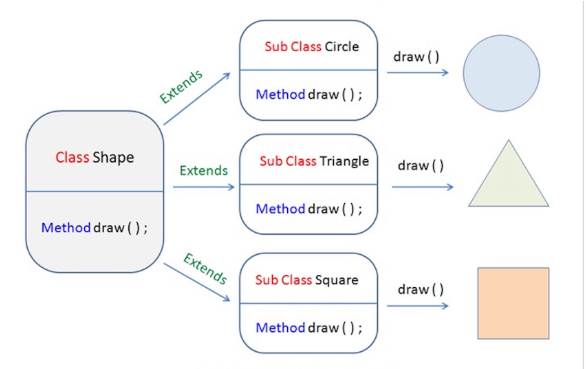
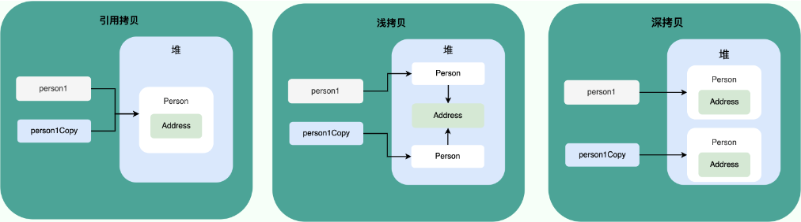

# 1. 面向对象和面向过程的区别
- 面向过程把解决问题的过程拆成一个个方法，通过一个个方法的执行解决问题。
- 面向对象会先抽象出对象，然后用对象执行方法的方式解决问题

    ###### 面向对象开发的程序一般更易维护、易复用、易扩展

# 2. 如果一个类没有声明构造方法，该程序能正确执行吗?
构造方法作用：
> 构造方法是一种特殊的方法，主要作用是完成对象的初始化工作。

> 如果一个类没有声明构造方法，也可以执行！因为一个类即使没有声明构造方法也会有默认的不带参数的构造方法。如果我们自己添加了类的构造方法（无论是否有参），Java 就不会添加默认的无参数的构造方法了。

> 我们一直在不知不觉地使用构造方法，这也是为什么我们在创建对象的时候后面要加一个括号（因为要调用无参的构造方法）。如果我们重载了有参的构造方法，记得都要把无参的构造方法也写出来（无论是否用到），因为这可以帮助我们在创建对象的时候少踩坑。


# 3. 构造方法有哪些特点？是否可被 override?
构造方法特点：
- 名字和类名相同
- 无需返回值，但不能用void声明构造函数
- 自动执行，无需调用

> 不能被override(重写)，但可以被overload(重载)，所以一个类里面有多个构造函数的情况

# 4. 面向对象的三大特征
1. 封装：把对象的信息隐藏在对象内部，但是可以提供一些方法给外部使用，来修改或读取对象内部的信息
```java
public class Student {
    private int id;//id属性私有化
    private String name;//name属性私有化

    //获取id的方法
    public int getId() {
        return id;
    }

    //设置id的方法
    public void setId(int id) {
        this.id = id;
    }

    //获取name的方法
    public String getName() {
        return name;
    }

    //设置name的方法
    public void setName(String name) {
        this.name = name;
    }
}
```
2. 继承:通过使用继承，可以快速地创建新的类，可以提高代码的重用，程序的可维护性，节省大量创建新类的时间 ，提高我们的开发效率

三大特点：
- 子类拥有父类对象所有的属性和方法（包括私有属性和私有方法），但是父类中的私有属性和方法子类是无法访问，只是拥有。
- 子类可以拥有自己属性和方法，即子类可以对父类进行扩展。
- 子类可以用自己的方式实现父类的方法。（以后介绍）。

3. 多态：多态，顾名思义，表示一个对象具有多种的状态，具体表现为父类的引用指向子类的实例。

特点：
- 对象类型和引用类型之间具有继承（类）/实现（接口）的关系；
- 引用类型变量发出的方法调用的到底是哪个类中的方法，必须在程序运行期间才能确定；
- 多态不能调用“只在子类存在但在父类不存在”的方法；
- 如果子类重写了父类的方法，真正执行的是子类覆盖的方法，如果子类没有覆盖父类的方法，执行的是父类的方法。

# 5. 接口和抽象类有什么共同点和区别？
共同点：
- 都不能被实例化
- 都可以包含抽象方法
- 都可以有默认实现的方法

区别：
- 接口主要用于对类的行为进行约束，你实现了某个接口就具有了对应的行为。抽象类主要用于代码复用，强调的是所属关系
- 一个类只能继承一个类，但是可以实现多个接口。
- 接口中的成员变量只能是 public static final 类型的，不能被修改且必须有初始值，而抽象类的成员变量默认 default，可在子类中被重新定义，也可被重新赋值。

# 6. 深拷贝和浅拷贝区别，什么是引用拷贝？

- 浅拷贝：浅拷贝会在堆上创建一个新的对象，如果原对象内部的属性是引用类型的话，浅拷贝会直接复制内部对象的引用地址，也就是说拷贝对象和原对象共用同一个内部对象。
- 深拷贝：深拷贝会完全复制整个对象，包括这个对象所包含的内部对象。
- 引用拷贝：引用拷贝就是两个不同的引用指向同一个对象。

    ###### 备注：引用对象三种是类，接口，数组

# 7. Object类常用方法有哪些？

Object 类是一个特殊的类，是所有类的父类。它主要提供了以下 11 个方法：
```java
/**
 * native 方法，用于返回当前运行时对象的 Class 对象，使用了 final 关键字修饰，故不允许子类重写。
 */
public final native Class<?> getClass()
/**
 * native 方法，用于返回对象的哈希码，主要使用在哈希表中，比如 JDK 中的HashMap。
 */
public native int hashCode()
/**
 * 用于比较 2 个对象的内存地址是否相等，String 类对该方法进行了重写以用于比较字符串的值是否相等。
 */
public boolean equals(Object obj)
/**
 * native 方法，用于创建并返回当前对象的一份拷贝。
 */
protected native Object clone() throws CloneNotSupportedException
/**
 * 返回类的名字实例的哈希码的 16 进制的字符串。建议 Object 所有的子类都重写这个方法。
 */
public String toString()
/**
 * native 方法，并且不能重写。唤醒一个在此对象监视器上等待的线程(监视器相当于就是锁的概念)。如果有多个线程在等待只会任意唤醒一个。
 */
public final native void notify()
/**
 * native 方法，并且不能重写。跟 notify 一样，唯一的区别就是会唤醒在此对象监视器上等待的所有线程，而不是一个线程。
 */
public final native void notifyAll()
/**
 * native方法，并且不能重写。暂停线程的执行。注意：sleep 方法没有释放锁，而 wait 方法释放了锁 ，timeout 是等待时间。
 */
public final native void wait(long timeout) throws InterruptedException
/**
 * 多了 nanos 参数，这个参数表示额外时间（以纳秒为单位，范围是 0-999999）。 所以超时的时间还需要加上 nanos 纳秒。。
 */
public final void wait(long timeout, int nanos) throws InterruptedException
/**
 * 跟之前的2个wait方法一样，只不过该方法一直等待，没有超时时间这个概念
 */
public final void wait() throws InterruptedException
/**
 * 实例被垃圾回收器回收的时候触发的操作
 */
protected void finalize() throws Throwable { }
```

# 8. ==和equals()的区别？

== 对于基本数据类型和引用类型的作用效果是不同的：
- 对于基本数据类型，==比较的是值
- 对于引用类型，==比较的是对象的内存地址

equals()方法的两种情况：
- 类没有重写equals方法：比较两个对象是否相等
- 类重写了equals方法：一般都重写equals()方法来比较两个对象的属性是否相等

# 9. hashCode()有什么用？
hashCode() 的作用是获取哈希码（int 整数），也称为散列码。这个哈希码的作用是确定该对象在哈希表中的索引位置。

注：hashCode()定义在JDK的Object类中，意味着所有的java类都有hashCode()函数，且是用C++或C实现的

# 10. 为什么要有 hashCode？
其实， hashCode() 和 equals()都是用于比较两个对象是否相等。
当需要大量并且快速对比的话，建议使用hashCode()来进行比较，效率比较高

原理：equals()相等的，hashCode()值一定相等，相反则不一定，两个都相等的说明两个对象相等

# 11. String、StringBuffer、StringBuilder的区别？
1. 可变性：
- String是不可变的
- StringBuffer和StringBuilder继承于AbstractStringBuilder类，在AbstractStringBuilder类中也是用字符数组保存字符串，不过没有private和final修饰
- append方法：
```java
abstract class AbstractStringBuilder implements Appendable, CharSequence {
    char[] value;
    public AbstractStringBuilder append(String str) {
        if (str == null)
            return appendNull();
        int len = str.length();
        ensureCapacityInternal(count + len);
        str.getChars(0, len, value, count);
        count += len;
        return this;
    }
    //...
}
```

2. 线程安全性：
- String对象是不可变的，线程安全
- StringBuffer对方法加了同步锁或者对调用的方法加了同步锁，所以是线程安全的
- StringBuilder并没有对方法进行加同步锁，所以是非线程安全的

3. 性能：
- String：每次对String类型进行改变时，都会创建一个新的String对象，然后将指针指向新的对象
- StringBuffer：对对象本身进行操作，而不是生成新的对象并改变对象引用
- StringBuilder：10%~15%的性能提升，但要冒着线程不安全的风险

4. 总结：
- 操作少量的数据: 适用 String
- 单线程操作字符串缓冲区下操作大量数据: 适用 StringBuilder
- 多线程操作字符串缓冲区下操作大量数据: 适用 StringBuffer

# 11. String 为什么是不可变的?
```java
public final class String implements java.io.Serializable, Comparable<String>, CharSequence {
    private final char value[];
  //...
}
```
String 真正不可变有下面几点原因：
- 保存字符串的数组被 final 修饰且为私有的，并且String 类没有提供/暴露修改这个字符串的方法。
- String 类被 final 修饰导致其不能被继承，进而避免了子类破坏 String 不可变。

# 12. 字符串拼接用"+"还是用StringBuilder?
Java 语言本身并不支持运算符重载，“+”和“+=”是专门为 String 类重载过的运算符，也是 Java 中仅有的两个重载过的运算符。

```java
String str1 = "he";
String str2 = "llo";
String str3 = "world";
String str4 = str1 + str2 + str3;
```
内部字节码实现：
- 本质上还是创建了一个StringBuilder对象调用append()方法实现拼接的，拼接完后会调用toString()得到一个String对象
- 缺陷：编译器不会创建单个 StringBuilder 以复用，会导致创建过多的 StringBuilder 对象。

如果直接使用 StringBuilder 对象进行字符串拼接的话，就不会存在这个问题了。
```java
String[] arr = {"he", "llo", "world"};
StringBuilder s = new StringBuilder();
for (String value : arr) {
    s.append(value);
}
System.out.println(s);
```
###### 在 JDK9 当中，字符串相加 “+” 改为了用动态方法 makeConcatWithConstants() 来实现，而不是大量的 StringBuilder 了。

# 13. 字符串常量池的作用了解吗？
###### 字符串常量池 是 JVM 为了提升性能和减少内存消耗针对字符串（String 类）专门开辟的一块区域，主要目的是为了避免字符串的重复创建。
```java
// 在堆中创建字符串对象”ab“
// 将字符串对象”ab“的引用保存在字符串常量池中
String aa = "ab";
// 直接返回字符串常量池中字符串对象”ab“的引用
String bb = "ab";
System.out.println(aa==bb);// true
```

# 14. String s1 = new String("abc");这句话创建了几个字符串对象？
- 如果字符串常量池不存在"abc"对象的引用，那么会创建两个字符串的对象，一个是创建的String对象，一个会保存在字符串常量池中
- 如果字符串常量池中已存在字符串对象“abc”的引用，则只会在堆中创建 1 个字符串对象“abc”。

# 15. String#intern 方法有什么作用?
String.intern() 是一个 native（本地）方法，其作用是将指定的字符串对象的引用保存在字符串常量池中，可以简单分为两种情况：
- 如果字符串常量池保存了对于字符串的引用，那么就返回该引用
- 如果字符串常量池中没有保存了对应的字符串对象的引用，那就在常量池中创建一个指向该字符串对象的引用并返回。
```java
// 在堆中创建字符串对象”Java“
// 将字符串对象”Java“的引用保存在字符串常量池中
String s1 = "Java";
// 直接返回字符串常量池中字符串对象”Java“对应的引用
String s2 = s1.intern();
// 会在堆中在单独创建一个字符串对象
String s3 = new String("Java");
// 直接返回字符串常量池中字符串对象”Java“对应的引用
String s4 = s3.intern();
// s1 和 s2 指向的是堆中的同一个对象
System.out.println(s1 == s2); // true
// s3 和 s4 指向的是堆中不同的对象
System.out.println(s3 == s4); // false
// s1 和 s4 指向的是堆中的同一个对象
System.out.println(s1 == s4); //true
```

# 16. String 类型的变量和常量做“+”运算时发生了什么？
对于编译期可以确定值的字符串，也就是常量字符串 ，jvm 会将其存入字符串常量池。并且，字符串常量拼接得到的字符串常量在编译阶段就已经被存放字符串常量池，这个得益于编译器的优化。

```java
String str1 = "str";
String str2 = "ing";
String str3 = "str" + "ing"; //常量拼接
String str4 = str1 + str2; //变量拼接 引用的值在程序编译期是无法确定的，编译器无法对其进行优化。
String str5 = "string"; //常量
System.out.println(str3 == str4);//false
System.out.println(str3 == str5);//true
System.out.println(str4 == str5);//false
```
