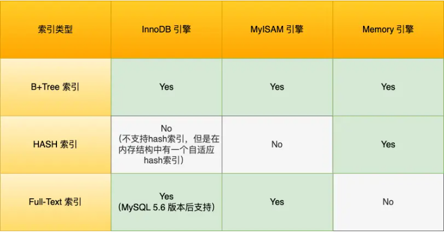
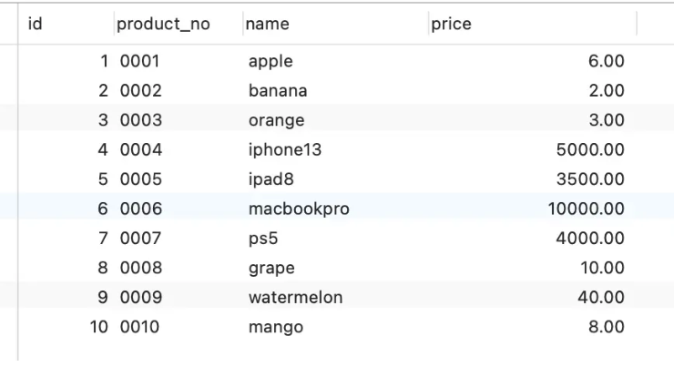
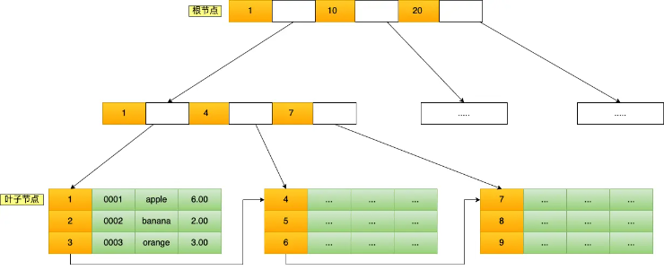
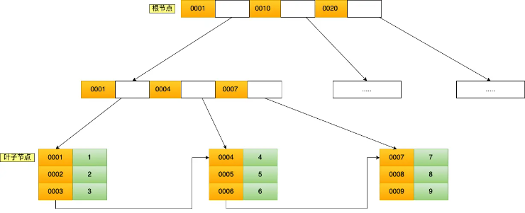
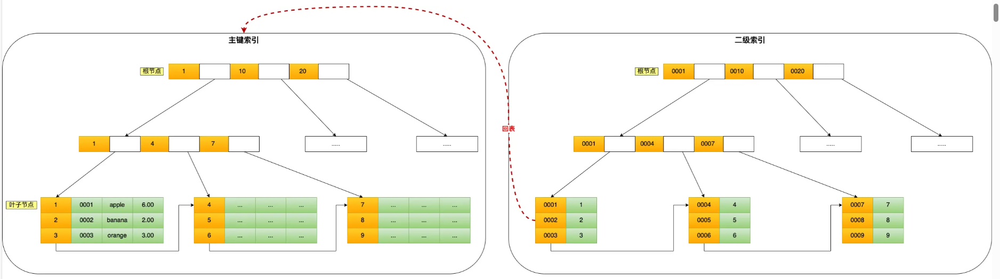
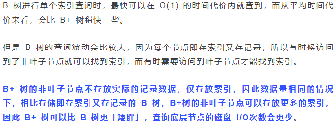
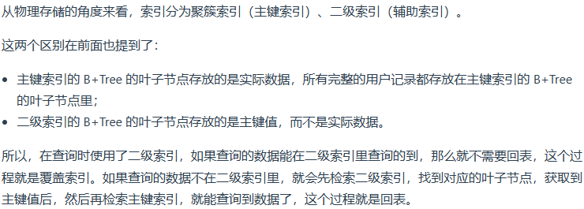
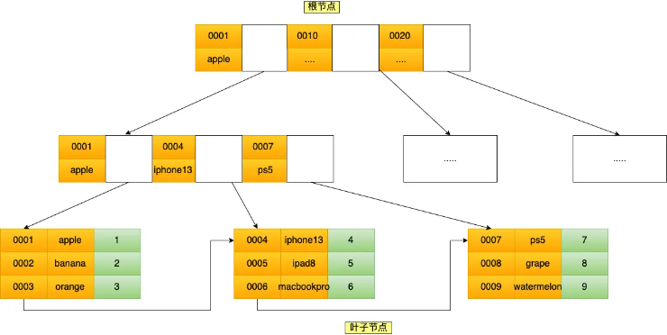
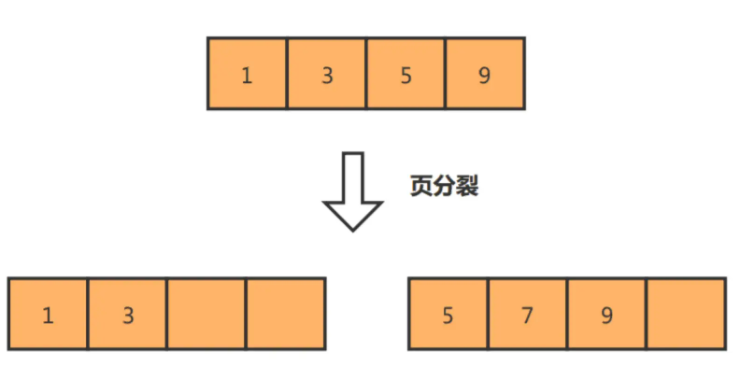
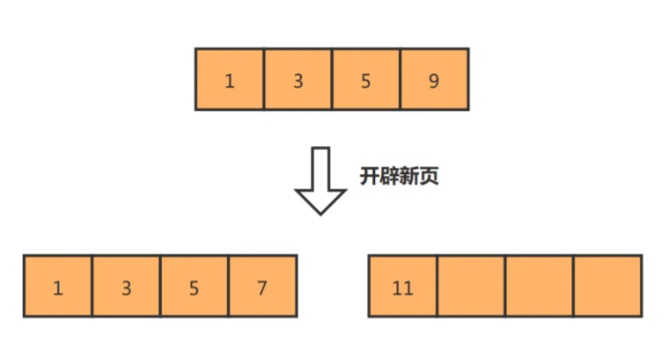

# 索引基础

# 1.1什么是索引

定义：帮助存储引擎快速获取数据的数据结构，索引就是数据的目录

存储引擎定义：说白了就是如何存储数据、如何为存储的数据建立索引和如何更新、查询数据等技术的实现方法。

MySQL 存储引擎有 MyISAM 、InnoDB、Memory，其中 InnoDB是MySQL5.5后默认的存储引擎

# 1.2索引的分类
## 1.2.1 按数据结构分类

InnoDB选择列作为索引的三种情况
- 有主键，默认使用主键作为聚簇索引的索引键
- 没有主键，那就选择第一个不包含NULL值的唯一列作为聚簇索引的索引键
- 上面两种情况都没有的情况，InnoDB自动生成一个隐式ID列作为聚簇索引的索引键
    ###### 创建的主键索引(聚簇索引)和二级索引默认使用的是B+Tree结构

####  B+Tree存储和查询过程
```sql
CREATE TABLE `product`  (
  `id` int(11) NOT NULL,
  `product_no` varchar(20)  DEFAULT NULL,
  `name` varchar(255) DEFAULT NULL,
  `price` decimal(10, 2) DEFAULT NULL,
  PRIMARY KEY (`id`) USING BTREE
) CHARACTER SET = utf8 COLLATE = utf8_general_ci ROW_FORMAT = Dynamic;
```
里面的数据

用B+TreeTree存储数据的结构

执行这条SQL语句
```sql
select * from product where id= 5;
```
##### 通过主键查询执行过程：
B+Tree会自顶向下逐层查找
1. 将 5 与根节点的索引数据 (1，10，20) 比较，5 在 1 和 10 之间，所以根据 B+Tree的搜索逻辑，找到第二层的索引数据 (1，4，7)；
2. 在第二层的索引数据 (1，4，7)中进行查找，因为 5 在 4 和 7 之间，所以找到第三层的索引数据（4，5，6）；
3. 在叶子节点的索引数据（4，5，6）中进行查找，然后我们找到了索引值为 5 的行数据。

数据库的索引和数据都是存储在硬盘的，我们可以把读取一个节点当作一次磁盘 I/O 操作。那么上面的整个查询过程一共经历了 3 个节点，也就是进行了 3 次 I/O 操作。

##### 二级索引查询执行过程
- ###### 主键索引的B+树和二级索引的B+树的区别：
    主键索引的B+树的叶子节点存储的是主键值，而二级索引的B+树的叶子节点存储的是主键值
    
- ###### 用二级索引查找
    ```sql
    select * from product where product_no = '0002';
    ```
    会先检二级索引中的 B+Tree 的索引值（商品编码，product_no），找到对应的叶子节点，然后获取主键值，然后再通过主键索引中的 B+Tree 树查询到对应的叶子节点，然后获取整行数据。这个过程叫「回表」，也就是说要查两个 B+Tree 才能查到数据。
    
    注意：当查询的数据是能在二级索引的 B+Tree 的叶子节点里查询到，这时就不用再查主键索引查，比如下面这条查询语句：
    ```sql
    select id from product where product_no = '0002';
    ```
    只查询id值，也就是主键索引值，这也叫作*覆盖索引*

#### MySQL为什么使用 B+Tree？
1.分析索引要求：
##### 前提：MySQL数据是持久化的，也就是数据存储在本地磁盘中
- 能在尽可能少的磁盘的 I/O 操作中完成查询工作；
- 要能高效地查询某一个记录，也要能高效地执行范围查找；
    三个方面，B树和B+树性能对比：
    - 单点查询
    
    - 插入和删除效率
    B+树因为有大量的冗余节点，删除一个节点的时候，甚至可以不动非叶子节点
    - 范围查询
    因为B+树所有叶子节点是用链表链接起来的，当需要范围查找时，可以找到范围起点，然后遍历到范围终点，而B树没有将所有叶子节点用链表串联起来的结构，只能通过树的遍历来完成范围查询，这会涉及多个节点的磁盘 I/O 操作，范围查询效率不如 B+ 树


## 1.2.2 按物理存储分类


## 1.2.3 按字段特性分类
从字段特性的角度来看，索引分为主键索引、唯一索引、普通索引、前缀索引。
##### 主键索引
主键索引就是建立在主键字段上的索引，通常在创建表的时候一起创建，一张表最多只有一个主键索引，索引列的值不允许有空值。
```sql
CREATE TABLE table_name  (
  ....
  PRIMARY KEY (index_column_1) USING BTREE
);
```
##### 唯一索引
唯一索引建立在 UNIQUE 字段上的索引，一张表可以有多个唯一索引，索引列的值必须唯一，但是允许有空值。
```sql
CREATE TABLE table_name  (
  ....
  UNIQUE KEY(index_column_1,index_column_2,...) 
);
```
##### 普通索引
普通索引就是建立在普通字段上的索引，既不要求字段为主键，也不要求字段为 UNIQUE。
```sql
CREATE TABLE table_name  (
  ....
  INDEX(index_column_1,index_column_2,...) 
);
```
##### 前缀索引
前缀索引是指对字符类型字段的前几个字符建立的索引，而不是在整个字段上建立的索引，前缀索引可以建立在字段类型为 char、 varchar、binary、varbinary 的列上。
使用前缀索引的目的是为了减少索引占用的存储空间，提升查询效率。
```sql
CREATE TABLE table_name(
    column_list,
    INDEX(column_name(length))
); 
```

## 1.2.4 按字段个数分类
- 建立在单列上的索引称为单列索引，比如主键索引
- 建立在多列上的索引称为联合索引
```sql
CREATE INDEX index_product_no_name ON product(product_no, name);
```

可以看到，联合索引的非叶子节点用两个字段的值作为 B+Tree 的 key 值。当在联合索引查询数据时，先按 product_no 字段比较，在 product_no 相同的情况下再按 name 字段比较。

因此使用联合索引时存在最左匹配原则，按照最左优先的方式进行索引的匹配，如(a,b,c)的联合索引，在使用下面语句时匹配联合索引：
- where a = 1;
- where a=1 and b=2 and c=3；
- where a=1 and b=2；
但是以下这几种情况q情况是无法使用联合索引的：
- where b=2 and c=3；
- where b=2；
上面这些查询条件之所以会失效，是因为(a, b, c) 联合索引，是先按 a 排序，在 a 相同的情况再按 b 排序，在 b 相同的情况再按 c 排序。所以，*b 和 c 是全局无序，局部相对有序的*，这样在没有遵循最左匹配原则的情况下，是无法利用到索引的。

综上所示，联合索引的最左匹配原则，在遇到范围查询（如 >、<）的时候，就会停止匹配，也就是范围查询的字段可以用到联合索引，但是在范围查询字段的后面的字段无法用到联合索引。注意，对于 >=、<=、BETWEEN、like 前缀匹配的范围查询，并不会停止匹配，前面我也用了四个例子说明了。

##### 索引下推
MySQL 5.6 引入的索引下推优化（index condition pushdown)， 可以在联合索引遍历过程中，对联合索引中包含的字段先做判断，直接过滤掉不满足条件的记录，减少回表次数。
简单来说：就是在联合索引查询中，如果出现只使用了一部分字段在联合索引中查询，剩余部分就会使用回表查询，避免这种情况，在使用联合索引查询时先对联合索引中不使用的部分字段先进行过滤，然后再使用联合索引查询，来减少回表的操作。

##### 索引区分度
公式： 

distinct(column)指的是某个字段中不同值的个数，如a字段中 有 1，1，2，3 那就有三个不同值个数

### 什么时候需要索引或不需要索引？
#### 什么时候适用？
- 字段有唯一性限制
- 经常使用在Where查询条件的字段
- 经常使用在GROUP BY和ORDER BY的字段

#### 什么时候不适用？
- WHERE 条件，GROUP BY，ORDER BY 里用不到的字段
- 字段中存在大量重复数据，不需要创建索引，比如性别字段
- 表数据太少的时候，不需要创建索引
- 经常更新的字段，如电商项目中用户的余额字段


### 优化索引
#### 1.前缀索引优化
定义：使用某个字符字段的前几个字符建立索引
好处：
1. 减少索引字段大小
坏处：
- ORDER BY 无法使用前缀索引
- 无法把前缀索引用作覆盖索引

#### 2.覆盖索引优化
定义：在二级索引中，直接在B+树中直接获得记录，减少回表操作

##### 例子：
假设我们只需要查询商品的名称、价格，有什么方式可以避免回表呢？

我们可以建立一个联合索引，即「商品ID、名称、价格」作为一个联合索引。如果索引中存在这些数据，查询将不会再次检索主键索引，从而避免回表。

#### 3.主键索引自增
好处：如果我们使用自增主键，每次插入的新数据就会按顺序添加到当前索引节点的位置，不需要移动已有的数据，当页面写满，就会自动开辟一个新页面。因为每次*插入一条新记录，都是追加操作，不需要重新移动数据*，因此这种插入数据的方法效率非常高。
自增主键情况：

非自增主键情况：


#### 4.防止索引失效
定义：在使用联合索引时候，会出现只使用了一部分索引字段，其他索引字段失效的情况。
参考1.2.4的情况，避免出现这种情况。
