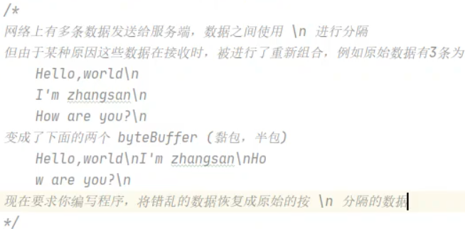
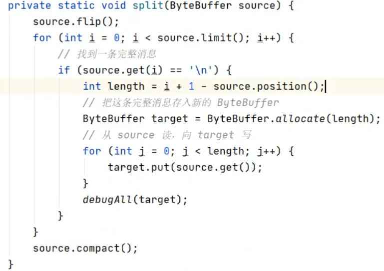

## 1. ByteBuffer 正确使用方法
> 1. 向buffer写入数据，例如调用channel.read(buffer)
> 2. 调用filp()切换到读模式
> 3. 从buffer读取数据，例如调用buffer.get()
> 4. 调用clear()或compact()清空缓冲区(写模式)
> 5. 重复1~4步骤，直到读完数据

## 2. ByteBuffer结构
有三个字段:
position: 读写位置
limit: 读写限制
capacity: 缓冲区的总容量

调用filp()时，position为读取位置0，limit为读取限制
调用clear()时，position为0，limit为capacity
调用compact()时，适用于未读取完毕，但是要接着写操作，把未读取完的数据(position到limit之间)复制到缓冲区的开头，然后limit设置为capacity，position设置为剩余数据的长度(limit-position)

## 3. ByteBuffer的常用方法

##### 上面的三个模式切换:
- filp()切换到读模式
- clear()清空缓冲区
- compact()压缩缓冲区

##### 分配缓冲区空间
- allocate()分配缓冲区(不能动态分配) 内部是用java 堆内存，读写效率低，收到GC影响
- allocateDirect()                 内部是用直接内存，读写效率高，不会受GC影响，但分配内存效率低


##### 读写模式
- 向Buffer写入数据
```java
int readBytes = channel.read(buf);
buf.put((byte) 127)
```

- 从Buffer读取数据:
```java
int writeBytes = channel.write(buf);
byte b = buf.get();
```

- 读取补充方法
```java
ByteBuffer buffer = ByteBuffer.allocate(10);
buffer.put(new byte[]{'a','b','c','d'});
buffer.filp();

buffer.get(new byte[4]); //读取四个字节到数组
buffer.rewind(); //重置position为0
buffer.mark(); //标记当前的position位置
buffer.reset(); //重置position为mark的位置

buffer.get(3); //读取position为3的字节，但不会修改position位置
```

##### 字符串和Buffer之间的转换
字符串转换为ByteBuffer:
```java
//方法一
ByteBuffer buffer1 = ByteBuffer.allocate(16);
buffer.put("hello".getBytes());
//方法二
ByteBuffer buffer2 = StandardCharsets.UTF_8.encode("hello");
//方法三
ByteBuffer buffer3 = ByteBuffer.warp("hello".getBytes());
```

ByteBuffer转换为字符串:
注意这是通过position来读取字符来实现的，所以解码时要把position调整到可读全部字符
```java
String str1 = StandardCharsets.UTF_8.decode(buffer).toString();
```

## 4. Scattering Reads
思想: 分散读, 读取一次，把数据分散给多个Buffer
```java
FileChannel channel = FileChannel.open(Paths.get("File.txt"));
channel.read(new ByteBuffer[]{buffer1,buffer2,buffer3});
```
## 5. Gathering Writes
思想: 集中写，把多个Buffer内容聚焦到一起写入
```java
channel.write(new ByteBuffer[]{buffer1,buffer2,buffer3});
```

## 6. 练习

- 粘包问题:  
- 半包问题: 

> 
> 

