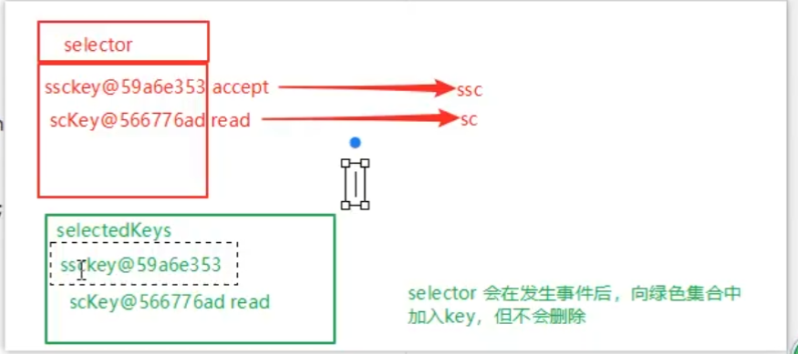

# 网络编程

## 1. 非阻塞和阻塞

### 阻塞模式
```java
//Server
ServerSocketChannel serverSocketChannel = ServerSocketChannel.open();
serverSocketChannel.bind(new InetSocketAddress(8080));
SocketChannel socketChannel = serverSocketChannel.accept(); //这会阻塞等待客户端连接
socketChannel.read(new ByteBuffer[1024]); //这会阻塞等待客户端发送数据
```

缺点是:没有连接或数据没有发送时，会出现一直阻塞

### 非阻塞模式
```java
//Server
ServerSocketChannel serverSocketChannel = ServerSocketChannel.open();
serverSocketChannel.bind(new InetSocketAddress(8080));

serverSocketChannel.configureBlocking(false); //设置服务器Socket通道为非阻塞模式
SocketChannel socketChannel = serverSocketChannel.accept(); //这会阻塞等待客户端连接 此时accept()不会阻塞，如果没有连接就返回null

socketChannel.configureBlocking(false); //设置连接通道对象为非阻塞模式
socketChannel.read(new ByteBuffer[1024]); //这不会阻塞等待客户端发送数据，如果没有数据就返回0
```

虽然非阻塞模式下，解决阻塞等待的问题，但还是会一直占用CPU资源

### 多路复用模式
使用Selector可以实现非阻塞模式下的多路复用，Selector可以同时监控多个SocketChannel，从而实现同时处理多个客户端连接。
每个SocketChannel都注册到Selector上，Selector根据注册的SocketChannel的状态，来判断哪个SocketChannel可以进行IO操作。
通过绑定事件到Selector上，Selector可以实现非阻塞的IO操作。
selector.select()会阻塞等待有事件发生，如果没有事件发生，则一直阻塞。

## 2. Selector
```java
Selector selector = Selector.open();  //创建Selector对象
ServerSocketChannel ssc = ServerSocketChannel.open(); //创建ServerSocketChannel
SelectionKey sscKey = ssc.register(selector, 0,null); //注册ServerSocketChannel到Selector
sscKey.interestOps(SelectionKey.OP_ACCEPT); //设置ServerSocketChannel的监听事件为ACCEPT
selecotr.select(); //阻塞等待有事件发生
Iterator<SelectionKey> iter = selector.selectedKeys().iterator(); //获取发生事件的SelectionKey集合
while(iter.hasNext()){
    SelectionKey key = iter.next();
    ServerSocketChannel channel = (ServerSocketChannel) key.channel();
    key.cancel(); //取消注册
}
```


## 3. 处理accept事件
1. 创建Selector对象
2. 创建ServerSocketChannel对象
3. 将ServerSocketChannel注册到Selector上，监听ACCEPT事件
4. 调用Selector的select()方法，阻塞等待有事件发生
5. 获取发生事件的SelectionKey集合
6. 遍历SelectionKey集合，如果是ACCEPT事件，则从SelectionKey中获取SocketChannel对象，并处理

## 4. 处理read事件
1. 上面获取到SocketChannel对象后
2. 把SocketChannel注册到Selector上，监听READ事件
3. 从Key中获取SocketChannel对象，并创建ByteBuffer对象
4. 调用SocketChannel的read()方法，读取数据到ByteBuffer中

消息边界问题: 粘包半包问题

解决方案：
- 双端约定固定大小的通道(耗费空间大小浪费)
- 双端约定分隔符，服务端根据分隔符解析数据包(但是还是要临时约定一个通道大小)(需要解析效率比较低)
- 双端约定包头部，头部存储实际数据的大小，头部固定大小，实际数据大小根据头部来划分

NIO使用解析数据包解析时，如果数据包大于ByteBuffer容量，需要进行扩容
扩容过程：
每个Channel维护一个独立的ByteBuffer
```java
ServerSocketChannel ssc = ServerSocketChannel.open();
SelectionKey sscKey = ssc.register(selector,[绑定的事件类型],[绑定的附件(buffer)]);
```
解析过程: 使用get(i)来读取字符，如果出现分隔符就读取数据到分隔符，但是这时候buffer容量里面都没有出现分隔符
所以一个元素都不会读取，调用compact()方法，所以position会变成容量最大值位置，和limit一致，因此此时出现了数据包的半包问题
此时要创建一个新的ByteBuffer，大小为当前容量的两倍，然后将数据复制到新的ByteBuffer中，然后将position置为0，limit置为容量大小，继续解析数据包
selectionKey.attach(new ByteBuffer(2 * currentCapacity)); //绑定一个新的ByteBuffer到SelectioKey上，容量为当前容量的两倍

## 5. 优化


## 6. UDP