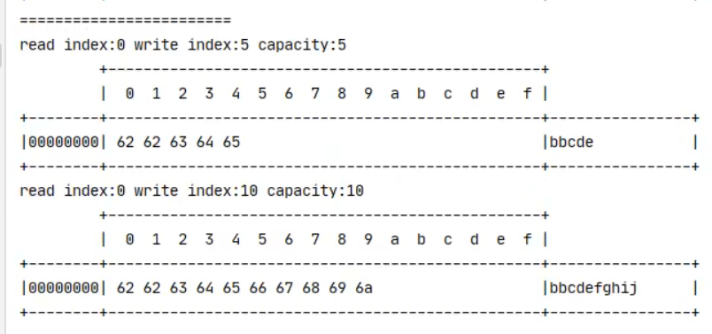

## 创建ByteBuf

```java
ByteBuf buf = ByteBufAllocator.DEFAULT.buffer(); // 默认分配256字节的缓冲区
StringBuilder sb = new StringBuilder();
System.out.println(buf); // 256
for (int i = 0; i < 1025; i++) {
    sb.append("a");
}
buf.writeBytes(sb.toString().getBytes());
// 自动扩容
System.out.println(buf); // 512
```

## 直接内存 vs 堆内存

1. 直接内存：直接在JVM堆外分配内存，不受JVM内存管理的限制(创建和销毁代价高，但读写性能高，配合池化技术使用)
2. 堆内存：JVM堆内分配内存，受JVM内存管理的限制

```java
ByteBuf buf = ByteBufAllocator.DEFAULT.heapBuffer(); // 堆内存分配
ByteBuf buf = ByteBufAllocator.DEFAULT.directBuffer(); // 直接内存分配
```


## 池化 vs 非池化

没有池化：每次都得创建新的ByteBuf实例，这个操作对于直接内存代价昂贵，就算是堆内存也会增加GC负担
池化：采用jemalloc类似的内存分配算法，提升分配效率
高并发下池化：节约内存，减少内存溢出可能


是否开启池化
```path
-Dio.netty.allocator.type=pooled // 开启池化
-Dio.netty.allocator.type=unpooled // 关闭池化
```

## ByteBuf组成部分

四部分：
- capacity: 容量
- maxCapacity: 最大容量(int 最大值)
- 读指针
- 写指针

## 写入
- writeBoolean(boolean value)  // 00代表false，01代表true
- writeByte(int value)
- writeShort(int value)
- writeInt(int value)         // 从低位到高位
- writeIntLE(int value)       // 从高位到低位   
- writeLong(long value)
- writeChar(int value)
- writeFloat(float value)
- writeDouble(double value)
- writeBytes(byte[] src)
- writeBytes(ByteBuf src) // 写入netty的ByteBuf

## 扩容规则
- 写入后数据大小未超过512，选择下一个16整数倍，如写入后数据大小是12，则扩容后为16
- 写入后数据大小超过512，选择下一个2的整数倍，如写入后数据大小是1025，则扩容后为2048
- 扩容不能超过maxCapacity


## 读取

```java
buffer.readByte() // 读取一个字节 且读指针向前移动一位字节
buffer.markReaderIndex() // 标记读指针位置
buffer.resetReaderIndex() // 重置读指针位置

buffer.getXXX() //此类api不会修改读指针
```

## 释放ByteBuf
```java
ByteBuf buf = ByteBufAllocator.DEFAULT.buffer();
buf.retain(); // 增加引用计数 
buf.release(); // 释放ByteBuf 引用计数 -1 
```

## 零拷贝

零拷贝是指在不占用额外内存的情况下，直接在两个缓冲区之间进行数据传输。

1. Slice
```java
ByteBuf buf = ByteBufAllocator.DEFAULT.buffer(10);
buf.writeBytes(byte[]{'a','b','c','d','e','f','g','h','i','j'});

ByteBuf f1 = buf.slice(0, 5); //最大maxCapacity会作限制，不能往后继续写数据 本质上是使用原ByteBuf的内存
f1.retain(); // 增加引用计数 
ByteBuf f2 = buf.slice(5, 5);
f2.retain(); // 增加引用计数 

buf.release(); // 释放原ByteBuf
System.out.println(f1); // 如果释放原来ByteBuf内存，会产生报错

f1.release(); // 释放f1
f2.release(); // 释放f2

f1.setByte(0, 'b');

```
f1和原ByteBuf


2. duplicate

和Slice类似，但是截取了原ByteBuf的内存，且不对maxCapacity作限制,只是读写指针是独立的

3. copy(深拷贝)

对底层内存数据进行深拷贝，无论如何读写，都不会影响原ByteBuf


## 组合缓冲区
```java
ByteBuf buf1 = ByteBufAllocator.DEFAULT.buffer(5);
buf1.writeBytes(new byte[]{'a','b','c','d','e'});

ByteBuf buf2 = ByteBufAllocator.DEFAULT.buffer(5);
buf2.writeBytes(new byte[]{'f','g','h','i','j'});

CompositeByteBuf buffer = ByteBufAllocator.DEFAULT.compositeBuffer();
buffer.retain(); // 增加引用计数 
buffer.addComponents(true, buf1, buf2);
```

## ByteBuf总结
- 池化技术：可以重用ByteBuf，节约内存，减少内存溢出可能
- 读写指针分离，不需要切换读写模式(position和limit)
- 自动扩容机制
- 零拷贝实现
- 支持链式调用，使用更流程