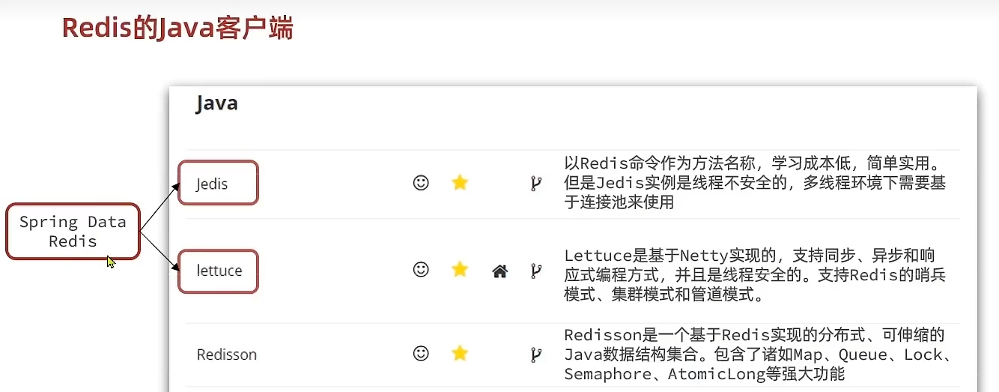

# 2.Redis-Java客户端


## 2.1 Jedis使用步骤

1.导入依赖

```xml
<!-- redis -->
<dependency>
    <groupId>redis.clients</groupId>
    <artifactId>jedis</artifactId>
    <version>5.0.1</version>
</dependency>
```
2.创建Jedis对象
```java
//1.建立连接
jedis = new Jedis("192.168.88.128",6379);
//2.设置秘密
jedis.auth("2002426");
//3.选择库
jedis.select(0);
```
3.使用jedis对象，方法名和Redis命令一样
```java
//1.存入数据
jedis.hset("user:1" , "name" ,"Jack");
jedis.hset("user:1","age","21");
//2。获取数据
Map<String,String> map = jedis.hgetAll("user:1");
System.out.println("map: " + map);
```
4.释放资源
```java
if(jedis!=null){
    jedis.close();
}
```

## 2.2 Jedis连接池配置
1.配置连接池
```java
private static final JedisPool jedisPool;
    static {
        //配置连接池
        JedisPoolConfig poolConfig = new JedisPoolConfig();
        //最大进程
        poolConfig.setMaxTotal(8);
        //最大空闲进程数
        poolConfig.setMaxIdle(8);
        //最小空闲进程数
        poolConfig.setMinIdle(0);
        jedisPool = new JedisPool(poolConfig,
                "192.168.88.128",6379,1000,"2002426");
    }
    public static Jedis getJedis(){
        return jedisPool.getResource();
    }
```
2.获取连接池连接
```java
jedis = JedisConnectionFactory.getJedis();
```
