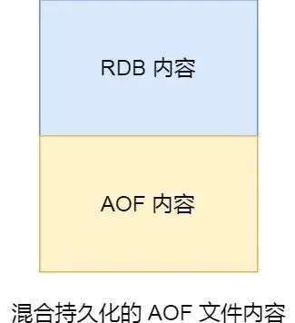

## RDB快照

RDB快照就是记录某一个瞬间的内存数据，记录的是实际数据，但是记录的是二进制文件。

> 优点是效率高，因为RDB文件记录的是数据，直接将内容读入内存就行


### 快照怎么用？

Redis提供了两个命令，分别是save和bgsave，区别是是否在主线程执行

- save命令: 在主线程执行生成RDB文件，可能阻塞主线程
- bgsave命令：在子进程生成RDB文件，可以避免主线程阻塞

Redis没有加载RDB文件的命令，每次在服务器启动时自动执行加载RDB文件

还有一种方式是在Redis配置文件里面设置每隔一段时间自动执行bgsave命令
```vim
save 900 1
save 300 10
save 60 10000
```
解释：900秒之内，对数据库进行了至少1次修改

> Redis快照是全局快照，执行快照恢复次数多了会影响效率

###  执行快照时，数据能被修改吗？

在执行bgsave过程中，Redis依然可以处理操作命令，数据可以被修改
##### 写时复制技术
> 使用写时复制技术(创建子进程时会复制父进程的页表给子进程，当发生内存修改后物理内存才会被复制一份，然后主进程操作这个副本)，这样可以减少创建子进程的性能损耗
##### 写时复制触发机制
> 如果主进程要修改共享数据里的某一块数据，就会发生这个写时复制
##### 出现的问题
> 发生写时复制时，RDB快照保存的还是原本的内存数据，但主进程已经修改了数据，这个时候只能交由下一次bgsave快照来处理新修改的数据

> 系统在创建完RDB快照文件后崩溃，Redis会丢失主进程在快照期间修改的数据

> 执行bgsave时，主进程和子进程共享物理内存，主进程执行了写操作，会把被修改的数据的物理内存复制一份，极端时会出现内存占满情况

### RDB和AOF合体

- 快照频率较低会导致，两次快照之间宕机的数据丢失较多
- 快照频率较高会导致，频繁写入硬盘和创建子进程，带来额外开销

#### 优化手段
Redis配置文件修改
```vim
aof-use-rdb-preamble yes
```
##### 开启后的流程

> 在AOF重写日志时(数据库读取所有数据，生成对应的写命令)，fork()出来子进程，先以RDB方式(二进制数据)将数据写入AOF文件，然后如果主进程出现写操作，会把记录写入重写缓冲区，重写缓冲区的命令又会以AOF方式(命令)写入AOF文件，AOF日志写入完毕后，将这个新生成的AOF文件替换旧的AOF文件。



前半部分加载比较快，后半部分兼顾快照期间主进程执行的写操作命令

