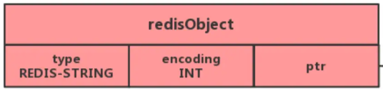

## 什么是Redis？

Redis是一个基于C语言开发的NoSQL数据库，它是保存在内存里面的内存数据库，因此读写速度非常快(少了IO操作)，Redis存储的是KEY-VALUE键值对类型的数据

## Redis的基本数据类型？

- String: 
    - 介绍：最基本的Keu-Value结构，不仅可以存放字符串，还可以存放数字(整数，浮点)
    - 内部实现：主要是int和SDS(简单字符串)，字符串内部编码encoding：int,raw,embstr(整数intm,长度小于32字节embstr，大于32字节raw)
                SDS结构是:free、len、buf[]
    - 应用场景：缓存对象、常规计数、分布式锁(通过setnx来实现，以key为唯一标识，)
- Hash: 
  - 介绍：
  - 内部实现：
  - 应用场景：
- List: 
  - 介绍：
  - 内部实现：
  - 应用场景：
- Set:  
  - 介绍：
  - 内部实现：
  - 应用场景：
- Zset: 
  - 介绍：
  - 内部实现：
  - 应用场景：

