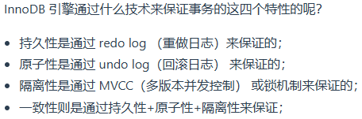
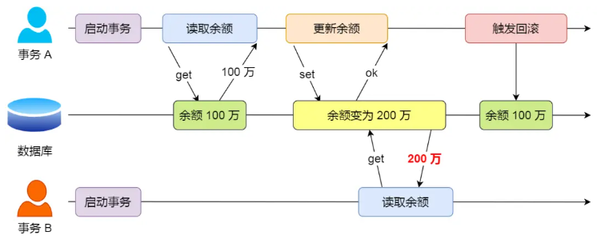
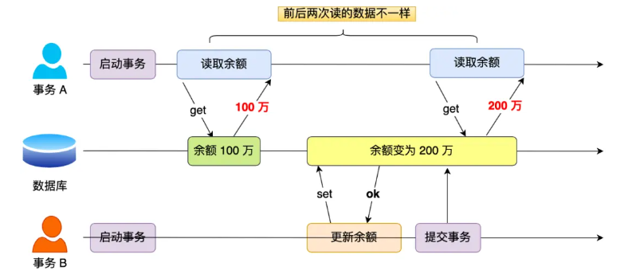
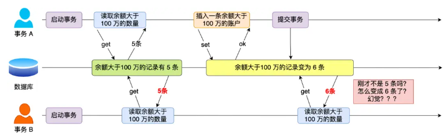
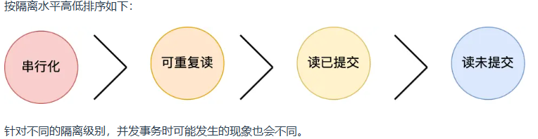
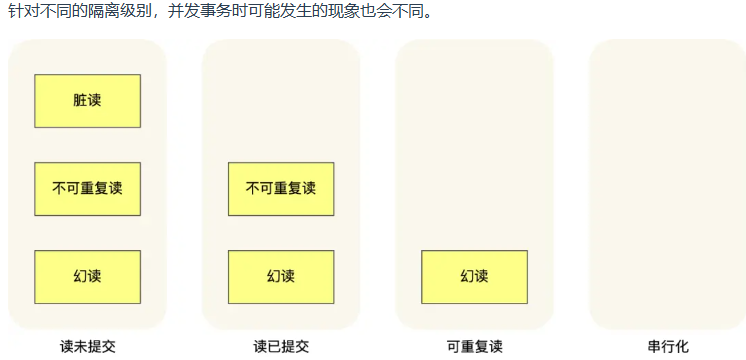
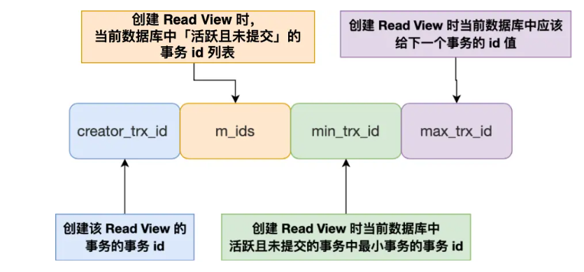
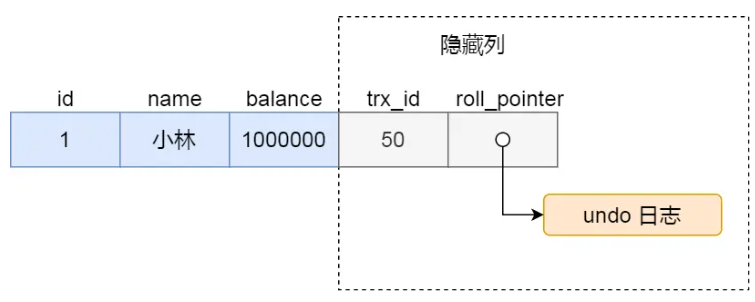
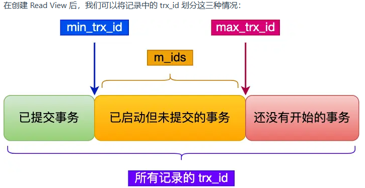
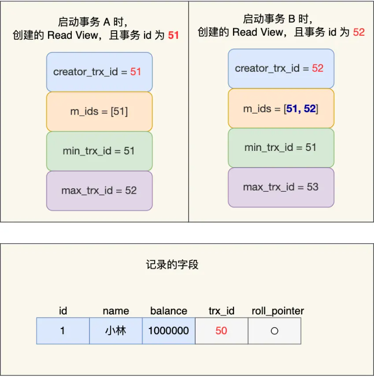

# 事务
前提：是由MySQL的引擎来实现的，不是所有的引擎都支持事务 （ MyISAM 引擎就不支持事务）

## 1.事务的特性
- 原子性：一个事务中所有的操作是不可划分的，要么全部一起完成，要么全部一起不完成，不会结束在某个中间操作状态
         事务在执行过程中发生错误，会回滚到事务执行前，好像事务从未执行过。
- 一致性：事务前和操作后，数据满足完整性约束，数据库数据保持一致
- 隔离性：允许事务并发，同时对其数据进行读写操作，每个事务都拥有自己的独立的数据空间，多个事务同时对同样的数据进行操作时，不会相互干扰（重点）
- 持久性：事务处理完后，对数据的修改是持久的

## 2.并发事务
前提：MySQL支持多个客户端进行连接， 那必然会导致MySQL同时处理事务的情况
##### 出现的问题
- 脏读：事务B读取了事务A的数据，之后该事务A回滚了，那么事务B读取到的数据就是过期的数据

- 不可重复读：事务A在一个事务内第一次读取前的数据和第二次读取的数据不一致，因为事务B在此之间提交了事务，修改了事务A读取到的数据

- 幻读：事务B在一次事务内第一次查询的记录数量和第二次查询的记录数量不一致，因为在事务B第一次查询和第二次查询之间事务A提交了新的记录数据

## 3.事务的隔离级别

SQL标准提出了四种隔离级别来规避这些现象，隔离级别越高，性能效率就越低
- 读未提交：指一个事务还没提交时，它做的变更就能被其他事务看到
- 读提交：指一个事务提交之后，它做的变更才能被其他事务看到
- 可重复读：指一个事务执行过程中看到的数据，一直跟这个事务启动时看到的数据是一致的，MySQL InnoDB 引擎的默认隔离级别
- 串行化：会对记录加上读写锁，在多个事务对这条记录进行读写操作时，如果发生了读写冲突的时候，后访问的事务必须等前一个事务执行完成，才能继续执行

### 四种隔离级别的实现
- 读未提交：直接读新的数据就行
- 串行化: 对读写加锁suo
- 可重复读：启动事务前生成一个Read View，整个事务都使用这个Read View
- 读提交：生成Read View在每一条语句执行前
Read View是数据快照，保存每一时刻的数据

### 两种开启事务的方法
- 第一种：begin/start transaction
    ##### 不代表事务启动了。只有在执行这个命令后，执行了第一条 select 语句，才是事务真正启动的时机
- 第二种: start transaction with consistent snapshot
    ##### 马上启动事务

## 4.Read View在MVCC里如何工作？

Read View四个字段：
- m_ids: 创建Read View时，活跃事务id列表(活跃事务指的是启动了但还未提交的事务)
- min_trx_id: 活跃事务id列表中最小的事务id
- max_trx_id: 活跃事务id列表中最大的事务id + 1 ，也就是应该给下一个事务的id值
- creator_trx_id: 创建Read View的事务的事务id

聚簇索引记录,还有两个隐藏列

- trx_id: 一个事务对某条聚簇索引记录进行改动时，会把这个事务的事务id记录在trx_id隐藏列里
- roll_pointer: 一个事务对某条聚簇索引记录进行改动时,会把旧记录写入到undo日志中，这个隐藏列存的是旧版本的指针，以方便找回修改前的记录

trx_id是聚簇索引的记录(也就是数据)，和Read View的记录相对比
- 如果trx_id 在min_trx_id之前，说明该记录创建在Read View之前，所以该版本的记录对当前的事务是*可见*
- 如果trx_id 在max_trx_id之后,说明该记录是在Read View创建之后才启动的事务生成的，所以该记录对当前事务*不可见*
- 如果trx_id在min_trx_id和max_trx_id之间，要分两种情况
    - 如果trx_id还在m_ids列表中，说明创建该版本记录的事务还活跃,所以该版本的记录对当前事务*不可见*
    - 如果trx_id不在m_ids列表中，说明创建该版本记录的事务已经提交，所以该版本的记录对当前事务*可见*

##### 这种通过「版本链」来控制并发事务访问同一个记录时的行为就叫 MVCC（多版本并发控制）。

## 5.可重复读是如何工作？
##### 例子

事务AB执行过程:
- 事务 B 读取小林的账户余额记录，读到余额是 100 万；
- 事务 A 将小林的账户余额记录修改成 200 万，并没有提交事务；
- 事务 B 读取小林的账户余额记录，读到余额还是 100 万；
- 事务 A 提交事务；
- 事务 B 读取小林的账户余额记录，读到余额依然还是 100 万；
##### 分析过程:
- 事务B读取记录，trx_id小于min_trx_id，说明该记录在事务B之前已经创建，该记录可读
- 事务A按照上面一条分析，可见可写，但未提交该事务，且把trx_id修改成51，roll_pointer指向旧版本
- 事务B第二次读取记录，发现trx_id在min_trx_id和max_trx_id之间，但trx_id还在m_ids列表中说明修改该记录的事务还在活跃，对事务B不可见，读取该记录的旧版本
- 事务A虽然已经提交了事务，但是事务B在隔离级别*可重复读*中工作，因此事务B读取记录时还是基于启动事务时的Read View来判断当前版本的记录是否可见，因此第三次读取的还是100万

## 6.读提交是如何工作？
##### 前提：隔离级别为*读提交*时，每次读取数据时，都会生成Read View
同可重复读的例子相同，前面都相同的原理，重点说明一下当事务A提交事务后事务B读取记录的情况：
- 当事务B读取了事务A刚修改并提交完的数据记录之后，会生成一个Read View，此时事务A已经提交了，在m_ids中没有包含事务的trx_id,因此事务B会读到事务A修改后的记录

## 7.总结
- 事务的四大特性是原子性、一致性、隔离性、持久性
- 当多个事务并发执行的时候，会引发脏读、不可重复读、幻读
- 四种隔离级别，分别是读未提交、读已提交、可重复读、串行化，从左往右隔离级别顺序递增，隔离级别越高，意味着性能越差，InnoDB 引擎的默认隔离级别是可重复读
- 要解决脏读现象，就要将隔离级别升级到读已提交以上的隔离级别，要解决不可重复读现象，就要将隔离级别升级到可重复读以上的隔离级别。
- 对于幻读现象，解决的方案有两种：
  - 针对快照读（普通 select 语句），是通过 MVCC 方式解决了幻读
  - 针对当前读（select ... for update 等语句），是通过 next-key lock（记录锁+间隙锁）方式解决了幻读