# MySQL有哪些锁？

## 全局锁
执行命令：
```sql
flush tables with read lock
```
执行后，整个数据库就处于只读状态了，这时其他线程执行以下操作，都会被阻塞：
- 对数据的增删改操作，比如 insert、delete、update等语句；
- 对表结构的更改操作，比如 alter table、drop table 等语句。
释放命令:
```sql
unlock tables
```

应用场景:
> 全局锁主要应用于做全库逻辑备份，这样在备份数据库期间，不会因为数据或表结构的更新，而出现备份文件的数据与预期的不一样。

缺点:
> 主要是当数据库数据量大的时候，加上全局锁，业务只能读数据
解决办法：
> 如果数据库的引擎支持的事务支持可重复读的隔离级别,在备份开始前开启事务，在这个隔离级别时，事务会创建Read View，这个Read View会记录当前数据库的快照，在备份期间，其他事务对数据库的更新，都不会影响到备份数据。

> 备份数据库的工具是 mysqldump，在使用 mysqldump 时加上 –single-transaction 参数的时候，就会在备份数据库之前先开启事务。这种方法只适用于支持「可重复读隔离级别的事务」的存储引擎。


## 表级锁
MySQL的表级锁有哪些？
### 表锁
加锁命令：
```sql
//表级别的共享锁，也就是读锁；
lock tables t_student read;

//表级别的独占锁，也就是写锁；
lock tables t_stuent write;
```
##### 表锁除了会限制别的线程的读写外，也会限制本线程接下来的读写操作。
```sql
unlock tables
```
##### 避免在使用 InnoDB 引擎的表使用表锁，因为表锁的颗粒度太大，会影响并发性能
### 元数据锁(MDL)
> 加锁: 对数据库表操作时会自动给这个表加锁

- 对一张表进行CRUD操作时加的是MDL读锁(允许多个线程读取共享资源，但是不允许写操作)
- 对一张表进行表结构修改时加的是MDL写锁(只允许一个线程获取写锁，写数据)

> 释放: 事务执行期间不会释放，待到提交事务后才会释放，事务期间一直存在MDL锁

##### 注意：申请 MDL 锁的操作会形成一个队列，队列中写锁获取优先级高于读锁，一旦出现 MDL 写锁等待，会阻塞后续该表的所有 CRUD 操作。

### 意向锁
- 在InnoDB引擎的表中对某些记录加上*共享锁*时，需要先在表级别上加上一个*意向共享锁*;
- 在InnoDB引擎的表中对某些记录加上*独占锁*时，需要先在表级别上加上一个*意向独占锁*;

- ###### 如果没有意向锁，在加上独占表锁时，需要遍历表里所有的记录，查看是否有记录已经加上了独占锁，效率会变慢

> 简单来说：意向锁的目的是为了快速判断表里是否有记录被加锁
### AUTO-INC锁
##### 简单来说就是为AUTO_INCREMENT修饰的字段赋值递增的值

完整执行过程：
> 在插入数据时，会加一个表级别的AUTO-INC锁，然后为需要自增的字段自增，等插入语句执行完后才释放这个锁，其他事务向该表插入语句都会被阻塞，但是这样会在有大量数据插入时影响性能。

###### 因此在MySQL 5.1.22时，InnoDB引入了一个轻量级的锁，这个锁是插入数据时给该字段赋值一个自增的值，然后就释放该轻量级的锁，不需要完整的执行完该插入语句才释放锁

InnoDB引擎提供了一个innodb_autoinc_lock_mode的系统变量，是用来控制使用AUTO-INC锁还是使用轻量级锁
- 当innodb_autoinc_lock_mode = 0，就采用AUTO-INC锁
- 当innodb_autoinc_lock_mode = 1:
  - 普通insert语句，自增锁申请后就释放；
  - 类似于insert ... select语句，这样批量插入的语句，自增锁还是要等语句结束后才释放
- 当innodb_autoinc_lock_mode = 2,采用的是轻量级的锁

但有一个问题，当innodb_autoinc_lock_mode = 2时会出现主从复制的数据不一致问题
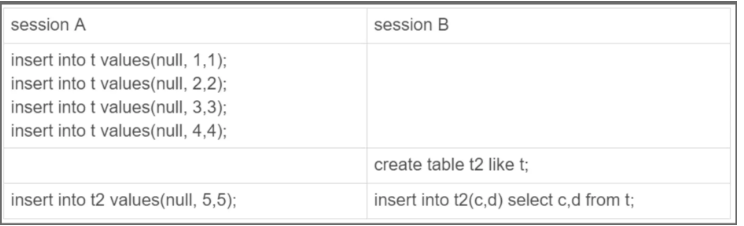
主库情况：
- session B 先插入了两个记录，(1,1,1)、(2,2,2)；
- 然后，session A 来申请自增 id 得到 id=3，插入了（3,5,5)；
- 之后，session B 继续执行，插入两条记录 (4,3,3)、 (5,4,4)。
> 从库情况：
 这个 binlog 拿去「从库」执行,顺序执行语句，执行完一条语句后才会执行下一条语句
 因此，在从库上「不会」发生像主库那样两个 session 「同时」执行向表 t2 中插入数据的场景。所以，在备库上执行了 session B 的 insert 语句，生成的结果里面，id 都是连续的。这时，主从库就发生了数据不一致

解决办法:
> 要解决这问题，binlog 日志格式要设置为 row，这样在 binlog 里面记录的是主库分配的自增值，到备库执行的时候，主库的自增值是什么，从库的自增值就是什么。

##### 总结
> 所以，当 innodb_autoinc_lock_mode = 2 时，并且 binlog_format = row，既能提升并发性，又不会出现数据一致性问题


## 行级锁


### Record Lock,记录锁(区分X锁和S锁)
```sql
select * from t_test where id = 1 for update;
```
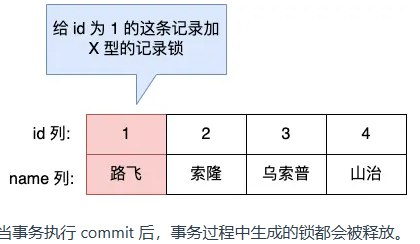

### Gap Lock,间隙锁(不区分S锁和X锁)
只存在于*可重复读*隔离级别中，为了解决幻读现象
其他事务不可插入id = 4 的记录
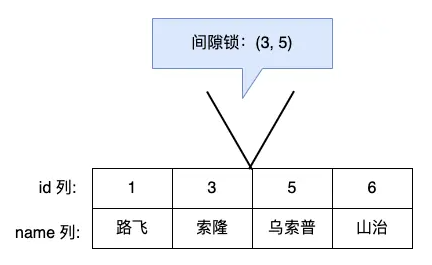
> 间隙锁之间是兼容的，即两个事务可以同时持有包含共同间隙范围的间隙锁，并不存在互斥关系，因为间隙锁的目的是防止插入幻影记录而提出的

### Next-Key Lock,临键锁(区分X锁和S锁)
表中有一个范围 id 为（3，5] 的 next-key lock，那么其他事务即不能插入 id = 4 记录，也不能修改 id = 5 这条记录。
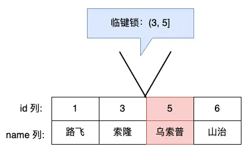
> next-key lock 是包含间隙锁+记录锁的，如果一个事务获取了 X 型的 next-key lock，那么另外一个事务在获取相同范围的 X 型的 next-key lock 时，是会被阻塞的。

## MySQL是怎么加行级锁的？
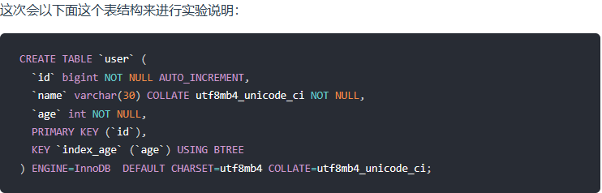


### 唯一索引等值查询
#### 1.记录存在的情况
```sql
select * from user where id = 1 for update;
```
> 表锁：X 类型的意向锁；
> 行锁：X 类型的记录锁；

事务A会为id = 1 这条记录加上X型记录锁
其他事务，对id=1进行删除或修改的时候会出现阻塞，因为更新或删除也会加上X型记录锁，会导致X型锁之间的互斥
#### 2.记录不存在的情况
```sql
select * from user where id = 2 for update;
```
> 表锁：X 类型的意向锁；
> 行锁：X 类型的间隙锁；

此时事务 A 在 id = 5 记录的主键索引上加的是间隙锁，锁住的范围是 (1, 5)。    
注意，如果其他事务插入的 id = 1 或者 id = 5 的记录话，并不会发生阻塞，而是报主键冲突的错误，因为表中已经存在 id = 1 和 id = 5 的记录了。

### 唯一索引范围查询
#### 针对于*大于或者大于等于*的查询
1.大于的情况
```sql
select * from user where id > 15 for update;
```
加锁情况：
> 最开始要找的第一行是 id = 20，由于查询该记录不是一个等值查询（不是大于等于条件查询），所以对该主键索引加的是范围为 (15, 20] 的 next-key 锁；

> 由于是范围查找，就会继续往后找存在的记录，虽然我们看见表中最后一条记录是 id = 20 的记录，但是实际在 Innodb 存储引擎中，会用一个特殊的记录来标识最后一条记录，该特殊的记录的名字叫 supremum pseudo-record ，所以扫描第二行的时候，也就扫描到了这个特殊记录的时候，会对该主键索引加的是范围为 (20, +∞] 的 next-key 锁。

> 停止扫描

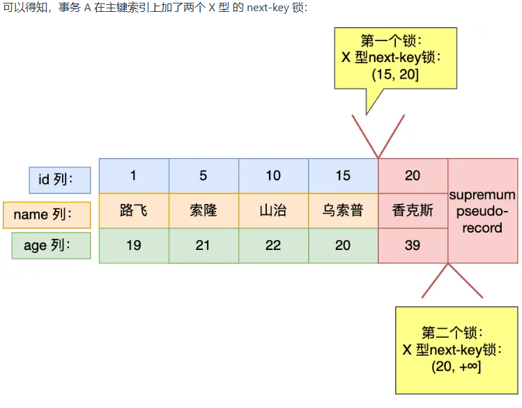

2.大于等于的情况
```sql
select * from user where id >= 15 for update;
```
加锁情况:
> 最开始要找的第一行是 id = 15，由于查询该记录是一个等值查询（等于 15），所以该主键索引的 next-key 锁会退化成记录锁，也就是仅锁住 id = 15 这一行记录。

> 由于是范围查找，就会继续往后找存在的记录，扫描到的第二行是 id = 20，于是对该主键索引加的是范围为 (15, 20] 的 next-key 锁；

> 接着扫描到第三行的时候，扫描到了特殊记录（ supremum pseudo-record），于是对该主键索引加的是范围为 (20, +∞] 的 next-key 锁。

> 停止扫描。

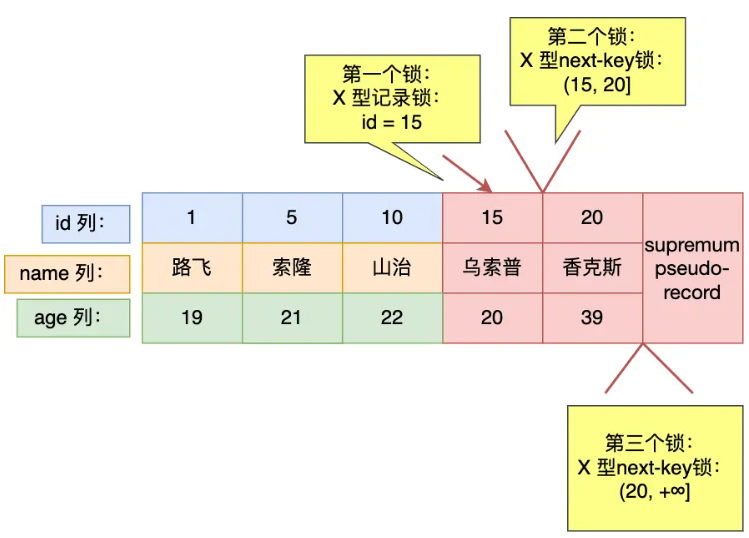

#### 针对于*小于或者小于等于*的查询
1.小于，查询条件中的值不在表数据中
```sql
select * from user where id < 6 for update;
```

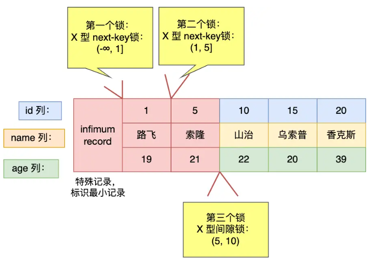

2.小于等于，查询条件中的值在数据表中
```sql
select * from user where id <= 5 for update;
```

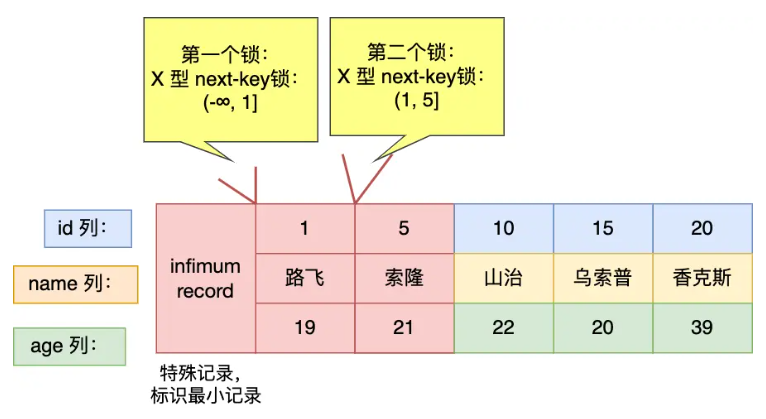

3.小于,查询条件中的值在数据表中
```sql
select * from user where id < 5 for update;
```

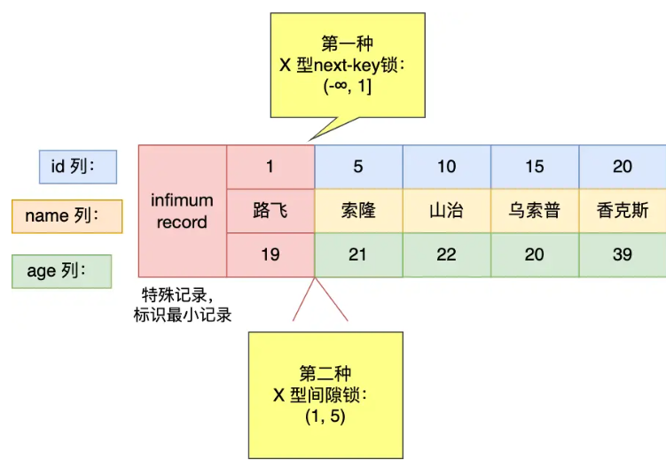

### 非唯一索引等值查询

#### 1.记录不存在
```sql
select * from user where age = 25 for update;
```
加锁过程：
- 定位到第一条不符合查询条件的二级索引记录，即扫描到 age = 39，于是该二级索引的 next-key 锁会退化成间隙锁，范围是 (22, 39)。
- 停止查询

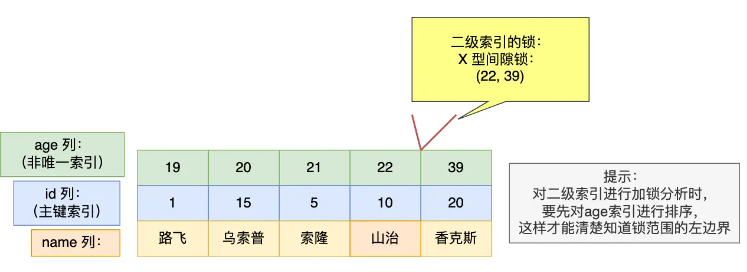
> 问题：当有一个事务持有二级索引的间隙锁 (22, 39) 时，什么情况下，可以让其他事务的插入 age = 22 或者 age = 39 记录的语句成功？又是什么情况下，插入 age = 22 或者 age = 39 记录时的语句会被阻塞？

###### 前提：二级索引树存放记录，是按照二级索引值顺序存放的，在相同二级索引值时，再按主键索引顺序存放

插入age = 22的情况：
- 成功：age = 22，id = 3，当插入age=22时，会按照主键排序age=22的顺序，可以得知此条插入的记录在间隙锁(22,39)中
- 失败：age = 22，id = 12，插入此条记录时，在age=22，id=10的后面，所以在间隙锁中，插入失败 

#### 2.记录存在
```sql
select * from user where age = 22 for update;
```
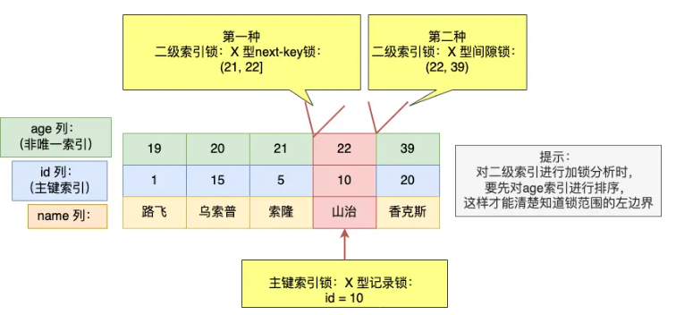
插入age = 22的情况:
- 成功: age = 22, id < 5,当插入age=22时，因为已经拥有了age = 22，所以会按照主键排序，如果id < 5 那排的顺序会在age = 21，id = 5前面，没有间隙锁
- 失败： age = 22, id>= 5，同上理由，插入失败

### 非唯一索引范围查询
```sql
select * from user where age >= 22  for update;
```

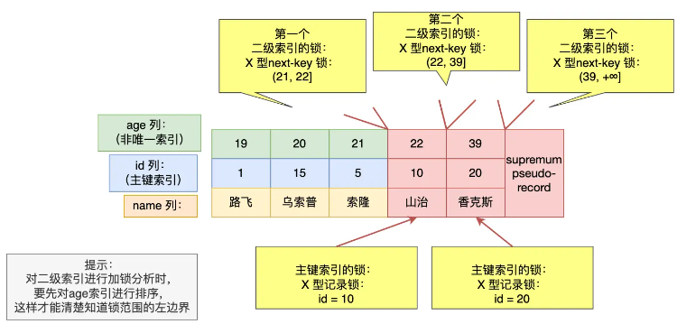

### 没有加索引的查询
> 如果锁定读查询语句，没有使用索引列作为查询条件，或者查询语句没有走索引查询，导致扫描是全表扫描。那么，每一条记录的索引上都会加 next-key 锁，这样就相当于锁住的全表，这时如果其他事务对该表进行增、删、改操作的时候，都会被阻塞。

> 因此，在线上在执行 update、delete、select ... for update 等具有加锁性质的语句，一定要检查语句是否走了索引，如果是全表扫描的话，会对每一个索引加 next-key 锁，相当于把整个表锁住了


## 死锁
1.死锁四个必要条件
- 互斥
- 占有并等待
- 不可强占用
- 循环等待

死锁例子
```sql
CREATE TABLE `t_order` (
  `id` int NOT NULL AUTO_INCREMENT,
  `order_no` int DEFAULT NULL,
  `create_date` datetime DEFAULT NULL,
  PRIMARY KEY (`id`),
  KEY `index_order` (`order_no`) USING BTREE
) ENGINE=InnoDB ;
```
表数据
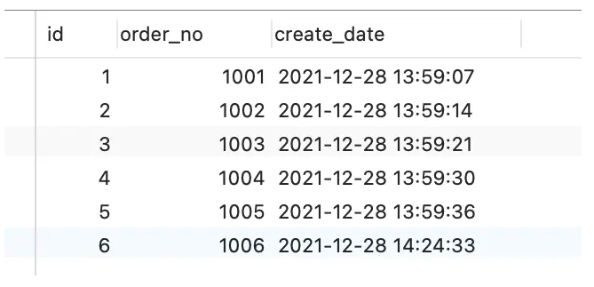
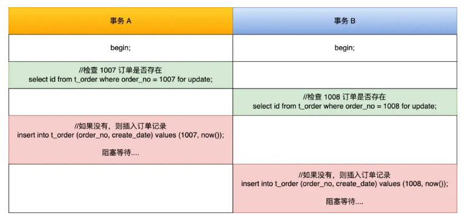
加锁分析:
当查询不存在的的等值查找，会出现临键锁退化成间隙锁
- 第一条查询1007，间隙锁范围左边值从1006开始出发，右边值是正无穷
- 第二条查询1008，同理间隙锁范围一样
- 此时事务A与B都拥有范围一样的间隙锁，这是不冲突的
- 但是接下来的两条插入语句，会为了获取意向锁，而等待对方的间隙锁释放，于是便有了循环等待

### Insert语句是如何加入行级锁的？
#### 1.记录之间加有间隙锁

#### 2.遇到唯一键冲突
