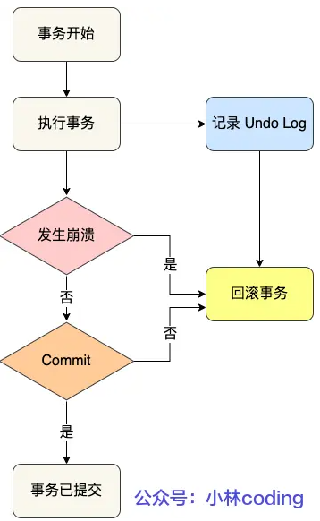
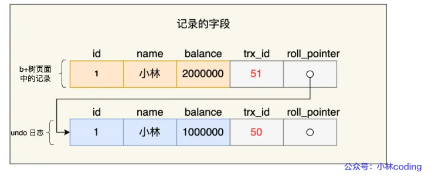
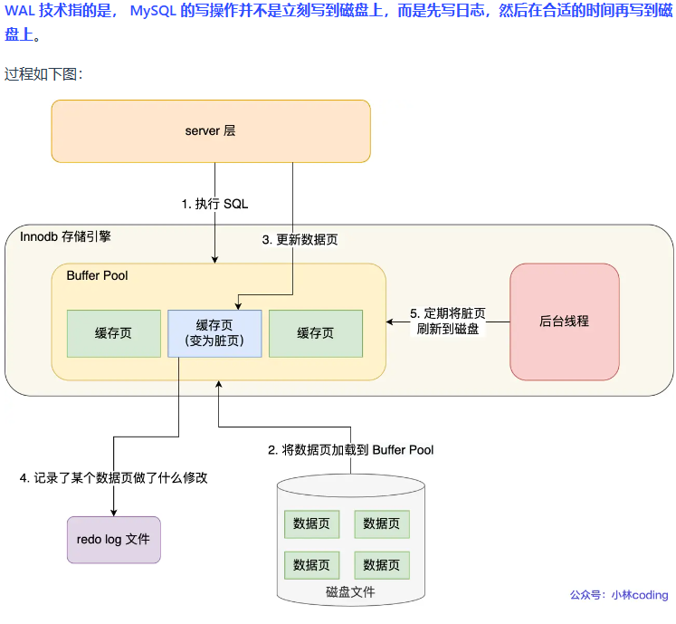
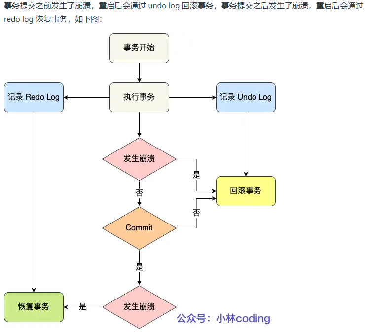
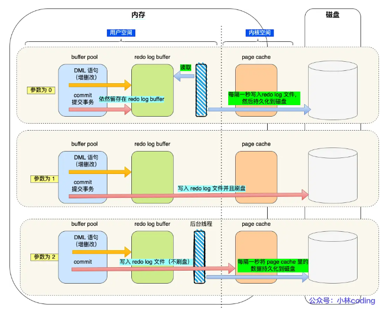
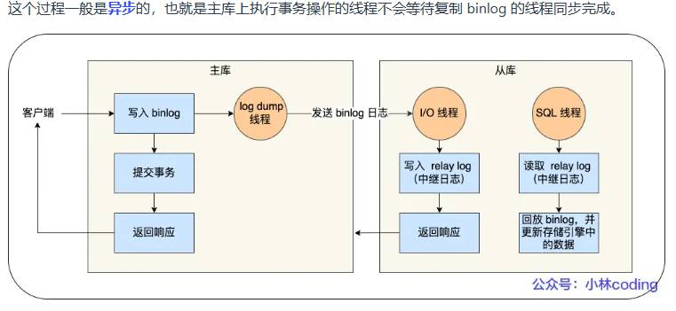
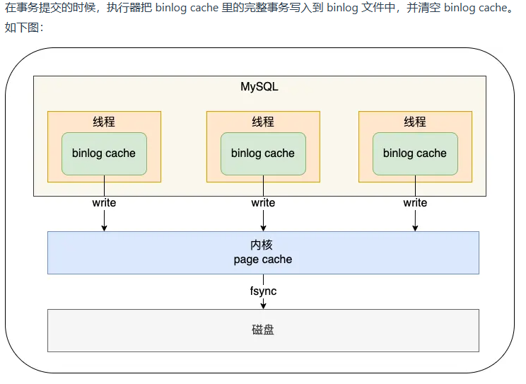
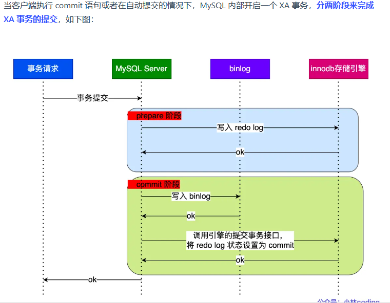
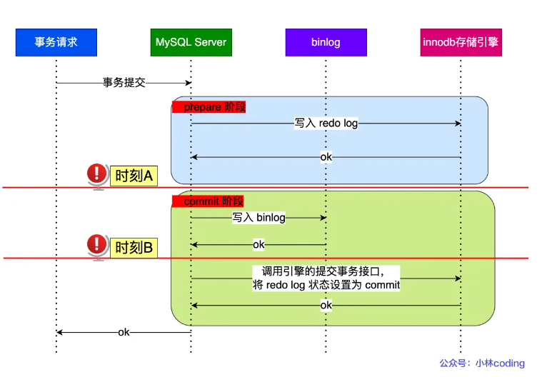

# MySQL日志：undo log、redo log、binlog有什么用？

## 为什么需要undo log？
1.事务中途崩溃时需要回滚

每当 InnoDB 引擎对一条记录进行操作（修改、删除、新增）时，要把回滚时需要的信息都记录到 undo log 里，比如：
- 在插入一条记录时，要把这条记录的主键值记下来，这样之后回滚时只需要把这个主键值对应的记录删掉就好了；
- 在删除一条记录时，要把这条记录中的内容都记下来，这样之后回滚时再把由这些内容组成的记录插入到表中就好了；
- 在更新一条记录时，要把被更新的列的旧值记下来，这样之后回滚时再把这些列更新为旧值就好了。
2.通过利用Read View + undo log实现MVCC(多版本并发控制)
对于*读提交*和可重复读*的隔离级别，只是创建Read View的时机不一样
- 读提交：在每一次快照读（select语句）后都生成一遍Read View
- 可重复读：启动时就生成一个Read View，然后整个事务期间都使用这个Read View
###### 实现是通过Read View里的字段和记录中两个隐藏列进行对比(trx_id和roll_pointer)


## 为什么需要Buffer Pool？
#### 前提：MySQL的数据都是保存在本地磁盘的，每次更新一条数据都要从磁盘访问读取该数据，然后在内存中修改它，修改完直接选择写回磁盘还是缓存起来呢？

> 答案肯定是缓存起来比较好，为此，InnoDB存储引擎设计了一个缓冲池(Buffer Pool)，来提高读取性能

### 有了Buffer Pool之后：
- 当读取数据之后，如果存在Buffer Pool，客户端就会先去读取Buffer Pool中的数据，然后再去磁盘中读取
- 当修改数据时，如果数据存在于Buffer Pool中，那么直接修改Buffer Pool中的数据所在的页，然后设置该页为脏页，因为已经和磁盘中的页数据不一样了，为了减少磁盘I/O，不会立即把脏页写回到磁盘中，会在某个恰当的时机由后台线程把脏页写回磁盘

### Buffer Pool缓存什么
InnoDB会把存储的数据划分若干个*页*，以页作为磁盘和内存的基本单位，一个页的默认大小是16KB，因此Buffer Pool也是按页来划分的

在MySQL启动的时候，InnoDB回为Buffer Pool申请一片连续的内存空间，然后按照默认的16KB每页来划分处一个个页，Buffer Pool中的页就叫作缓存页


> Undo页是记录什么？

开启事务后，InnoDB 层更新记录前，首先要记录相应的 undo log，如果是更新操作，需要把被更新的列的旧值记下来，也就是要生成一条 undo log，undo log 会写入 Buffer Pool 中的 Undo 页面。

> 查询一条记录，就只需要缓冲一条记录吗？

不是的。

当我们查询一条记录时，InnoDB 是会把整个页的数据加载到 Buffer Pool 中，将页加载到 Buffer Pool 后，再通过页里的「页目录」去定位到某条具体的记录。

## 为什么需要redo log？
### WAL （Write-Ahead Logging）技术

> 什么是redo log？

redo log 是物理日志，记录了某个数据页做了什么修改，比如对 XXX 表空间中的 YYY 数据页 ZZZ 偏移量的地方做了AAA 更新，每当执行一个事务就会产生这样的一条或者多条物理日志。

在事务提交时，只要先将 redo log 持久化到磁盘即可，可以不需要等到将缓存在 Buffer Pool 里的脏页数据持久化到磁盘。

当系统崩溃时，虽然脏页数据没有持久化，但是 redo log 已经持久化，接着 MySQL 重启后，可以根据 redo log 的内容，将所有数据恢复到最新的状态。

> 被修改 Undo 页面，需要记录对应 redo log 吗？

需要的

开启事务后，InnoDB 层更新记录前，首先要记录相应的 undo log，如果是更新操作，需要把被更新的列的旧值记下来，也就是要生成一条 undo log，undo log 会写入 Buffer Pool 中的 Undo 页面。

不过，在内存修改该 Undo 页面后，需要记录对应的 redo log。

> redo log 和 undo log 区别在哪？

- redo log 记录了此次事务「完成后」的数据状态，记录的是更新之后的值；
- undo log 记录了此次事务「开始前」的数据状态，记录的是更新之前的值；

所以有了 redo log，再通过 WAL 技术，InnoDB 就可以保证即使数据库发生异常重启，之前已提交的记录都不会丢失，这个能力称为 crash-safe（崩溃恢复）。可以看出来， redo log 保证了事务四大特性中的持久性。

> redo log写入磁盘的问题

##### 1.redo log 要写到磁盘，数据也要写磁盘，为什么要多此一举？
- 写入 redo log 的方式使用了追加操作， 所以磁盘操作是顺序写，而写入数据需要先找到写入位置，然后才写到磁盘，所以磁盘操作是随机写。
- 实现事务的持久性，让 MySQL 有 crash-safe 的能力，能够保证 MySQL 在任何时间段突然崩溃，重启后之前已提交的记录都不会丢失；

##### 2.产生的 redo log 是直接写入磁盘的吗？
不是的。

redo log也有自己的缓存，redo log buffer，每当产生一条 redo log 时，会先写入到 redo log buffer

##### 3.redo log 什么时候刷盘？
- MySQL正常关闭时；
- 当redo log buffer中记录写入量大于redo log buffer一半内存空间时
- InnoDB后台线程每隔一秒，将redo log buffer持久化到磁盘
- innodb_flush_log_at_trx_commit参数控制

##### 4.什么是innodb_flush_log_at_trx_commit？
- 参数为0时，每次事务提交还是将redo log留在redo log buffer中，这种情况事务提交不会主动触发写入磁盘的操作
- 参数为1时，每次事务提交时都会把redo log buffer里面的redo log持久化到磁盘
- 参数为2时，每次事务提交时，都只是缓存在redo log buffer写道redo log 文件，这不意味着写入磁盘，只是写入到了Page Cache里面


- 针对参数 0 ：会把缓存在 redo log buffer 中的 redo log ，通过调用 write() 写到操作系统的 Page Cache，然后调用 fsync() 持久化到磁盘。所以参数为 0 的策略，MySQL 进程的崩溃会导致上一秒钟所有事务数据的丢失;
- 针对参数 2 ：调用 fsync，将缓存在操作系统中 Page Cache 里的 redo log 持久化到磁盘。所以参数为 2 的策略，较取值为 0 情况下更安全，因为 MySQL 进程的崩溃并不会丢失数据，只有在操作系统崩溃或者系统断电的情况下，上一秒钟所有事务数据才可能丢失。
  
> 三个参数的应用场景？

- 数据安全性：参数1 > 参数2 > 参数0
- 写入性能： 参数0 > 参数2 > 参数1

所以，数据安全性和写入性能是熊掌不可得兼的，要不追求数据安全性，牺牲性能；要不追求性能，牺牲数据安全性。

##### 5.redo log文件写满了怎么办?
###### 前提： InnoDB 存储引擎有 1 个重做日志文件组( redo log Group），里面包含两个redo log文件组成，一个叫：ib_logfile0和ib_logfile1,两个文件大小一致

redo log是循环写的方式，write pos 是记录当前可以写入的地方，check point是脏页开始的地方，也可也说是当前要擦除的位置

- write pos和check point都是顺时针旋转的；
- write pos~check point是用来记录新的更新操作的；
- check point~write pos 是待落盘的脏数据页记录；
  
> 当write pos追上了check point时，也就代表着redo log文件满了，此时接下来执行的更新语句都会被阻塞，，就要清理Buffer Pool中的脏页刷新到磁盘中，然后标记redo log 哪些记录可以被擦除，然后对旧的redo log记录进行擦除，等擦除完后腾出空间，check point就会往后移动
## 为什么需要binlog？
前面介绍的 undo log 和 redo log 这两个日志都是 Innodb 存储引擎生成的。

MySQL 在完成一条更新操作后，Server 层还会生成一条 binlog，等之后事务提交的时候，会将该事物执行过程中产生的所有 binlog 统一写 入 binlog 文件。

binlog 文件是记录了所有数据库表结构变更和表数据修改的日志，不会记录查询类的操作，比如 SELECT 和 SHOW 操作。

> bin log和redo log 区别?

- 1.适用对象不同：
  - bin log 是Server层实现的日志，所有引擎都适用
  - redo log 是存储引擎实现的日志
- 2.文件格式不同：
  - binlog有三种文件格式：
    - STATEMENT(默认):每一条修改数据的 SQL 都会被记录到 binlog 中，如执行now()这样的函数会导致主从库时间不一样
    - ROW:记录行数据最终被修改成什么样了（这种格式的日志，就不能称为逻辑日志了），不会出现 STATEMENT 下动态函数的问题。
    - MIXED:包含了 STATEMENT 和 ROW 模式，它会根据不同的情况自动使用 ROW 模式和 STATEMENT 模式；
  - redo log是物理日志：记录的是在某个数据页做了什么修改，比如对 XXX 表空间中的 YYY 数据页 ZZZ 偏移量的地方做了AAA 更新；
- 3.写入方式不同：
    - binlog 是追加写，写满一个文件，就创建一个新的文件继续写，不会覆盖以前的日志，保存的是全量的日志。
    - redo log 是循环写，日志空间大小是固定，全部写满就从头开始，保存未被刷入磁盘的脏页日志。
- 4.用途不同：
  - binlog 用于备份恢复、主从复制；
  - redo log 用于掉电等故障恢复。

### 主从复制的实现：

MySQL 集群的主从复制过程梳理成 3 个阶段：
- 写入Binlog：主库接收客户端提交事务的请求，把对应的更新语句写入binlog中，再提交事务，更新存储引擎中的数据，事务提交完成后给客户端发送一个“操作成功”的响应
- 同步Binlog：从库会专门创建一个I/O线程，连接主库的log dump线程，来接收binlog日志，再把binlog信息写入relay log的中继日志中，然后向主库发送一个“复制成功”响应
- 回放Binlog：从库会专门创建一个回放binlog的线程，用于读取relay log线程，然后回放binlog更新存储引擎中的数据，最终实现主从数据一致性

> 从库是不是越多越好？

不是的。

因为从库数量增加，从库连接上来的 I/O 线程也比较多，主库也要创建同样多的 log dump 线程来处理复制的请求，对主库资源消耗比较高，同时还受限于主库的网络带宽。

所以在实际使用中，一个主库一般跟 2～3 个从库（1 套数据库，1 主 2 从 1 备主），这就是一主多从的 MySQL 集群结构。

> MySQL 主从复制还有哪些模型？

- 同步复制：MySQL 主库提交事务的线程要等待所有从库的复制成功响应，才返回客户端结果
- 异步复制（默认）：MySQL 主库提交事务的线程并不会等待 binlog 同步到各从库，就返回客户端结果。这种模式一旦主库宕机，数据就会发生丢失。
- 半同步复制：MySQL 5.7 版本之后增加的一种复制方式，介于两者之间，事务线程不用等待所有的从库复制成功响应，只要一部分复制成功响应回来就行，比如一主二从的集群，只要数据成功复制到任意一个从库上，主库的事务线程就可以返回给客户端。*这种半同步复制的方式，兼顾了异步复制和同步复制的优点，即使出现主库宕机，至少还有一个从库有最新的数据，不存在数据丢失的风险。*

> binlog 什么时候刷盘？

###### 前提：事务执行过程中，先把日志写入binlog cache中（Server层的Cache),事务提交后才把binlog cache写入到bin log 文件中

MySQL 给每个线程分配了一片内存用于缓冲 binlog ，该内存叫 binlog cache，参数 binlog_cache_size 用于控制单个线程内 binlog cache 所占内存的大小。如果超过了这个参数规定的大小，就要暂存到磁盘。

> 什么时候 binlog cache 会写到 binlog 文件？


虽然每个线程有自己 binlog cache，但是最终都写到同一个 binlog 文件：
- 图中的 write，指的就是指把日志写入到 binlog 文件，但是并没有把数据持久化到磁盘，因为数据还缓存在文件系统的 page cache 里，write 的写入速度还是比较快的，因为不涉及磁盘 I/O。
- 图中的 fsync，才是将数据持久化到磁盘的操作，这里就会涉及磁盘 I/O，所以频繁的 fsync 会导致磁盘的 I/O 升高。

MySQL提供一个 sync_binlog 参数来控制数据库的 binlog 刷到磁盘上的频率：
- sync_binlog = 0 的时候，表示每次提交事务都只 write，不 fsync，后续交由操作系统决定何时将数据持久化到磁盘；(默认，性能最好)
- sync_binlog = 1 的时候，表示每次提交事务都会 write，然后马上执行 fsync；（最安全）
- sync_binlog =N(N>1) 的时候，表示每次提交事务都 write，但累积 N 个事务后才 fsync。

如果能容少量事务的 binlog 日志丢失的风险，为了提高写入的性能，一般会 sync_binlog 设置为 100~1000 中的某个数值。

> 总结一条更新语句要发生的事情：

具体更新一条记录``` UPDATE t_user SET name = 'xiaolin' WHERE id = 1; ```的流程如下:
1.执行器调用存储引擎，在主键索引树中查找id = 1这条记录：
    - 如果这条记录在Buffer Pool中，直接返回给执行器；
    - 如果不在，那就需要去磁盘获取这条记录，然后返回给执行器；
2.执行器得到这条聚簇索引记录后，会看一下更新前的记录和更新后的记录是否一致：
    - 一致的话那就不需要执行操作
    - 不一致的话，需要把更新前的记录和更新后的记录作为参数送往InnoDB层
3.开启事务，InnoDB在更新记录前，要先把更新前的记录写入undo log ，生成一条undo log写入Buffer Pool中的undo页中
4.InnoDB层开始更新记录，先会更新内存（同时标记为脏页），然后将记录写道redo log中，这时候更新操作就算完成了，为了减少I/O操作，不会立即把脏页写入到磁盘中，后续由后台线程恰当时机写回脏页到磁盘，这是WAL技术
5.一条记录更新完成后，开始记录该语句到binlog，此时binlog会保存在binlog cache中，此时也不会立马把binlog写入磁盘，在事务提交后才统一将该事务运行过程中的所有binlog刷新到磁盘中
6.事务提交，两阶段提交，接下来会说明
## 为什么需要两阶段提交？
###### 事务提交后，需要把redo log 和 bin log持久化到磁盘，这是两个独立的逻辑

两种半成功的情况：
- 如果在将 redo log 刷入到磁盘之后， MySQL 突然宕机了，而 binlog 还没有来得及写入。
- 如果在将 binlog 刷入到磁盘之后， MySQL 突然宕机了，而 redo log 还没有来得及写入。

这是因为 redo log 影响主库的数据，binlog 影响从库的数据，所以 redo log 和 binlog 必须保持一致才能保证主从数据一致。

##### 解决办法：
> MySQL 为了避免出现两份日志之间的逻辑不一致的问题，使用了「两阶段提交」来解决，两阶段提交其实是分布式事务一致性协议，它可以保证多个逻辑操作要不全部成功，要不全部失败，不会出现半成功的状态。

> 两阶段提交把单个事务的提交拆分成了 2 个阶段，分别是「准备（Prepare）阶段」和「提交（Commit）阶段」
> 

- prepare 阶段：将 XID（内部 XA 事务的 ID） 写入到 redo log，同时将 redo log 对应的事务状态设置为 prepare，然后将 redo log 持久化到磁盘（innodb_flush_log_at_trx_commit = 1 的作用）；
- commit 阶段：把 XID 写入到 binlog，然后将 binlog 持久化到磁盘（sync_binlog = 1 的作用），接着调用引擎的提交事务接口，将 redo log 状态设置为 commit，此时该状态并不需要持久化到磁盘，只需要 write 到文件系统的 page cache 中就够了，因为只要 binlog 写磁盘成功，就算 redo log 的状态还是 prepare 也没有关系，一样会被认为事务已经执行成功；

##### 异常情况（通过查找XID来执行不同的方法）：

- 如果 binlog 中没有当前内部 XA 事务的 XID，说明 redolog 完成刷盘，但是 binlog 还没有刷盘，则回滚事务。对应时刻 A 崩溃恢复的情况。
- 如果 binlog 中有当前内部 XA 事务的 XID，说明 redolog 和 binlog 都已经完成了刷盘，则提交事务。对应时刻 B 崩溃恢复的情况。

> 所以说，两阶段提交是以 binlog 写成功为事务提交成功的标识，因为 binlog 写成功了，就意味着能在 binlog 中查找到与 redo log 相同的 XID。

##### 问题：
两阶段提交虽然保证了两个日志文件的数据一致性，但是性能很差，主要有两个方面的影响：
- 磁盘 I/O 次数高：对于“双1”配置，每个事务提交都会进行两次 fsync（刷盘），一次是 redo log 刷盘，另一次是 binlog 刷盘。
- 锁竞争激烈：两阶段提交虽然能够保证「单事务」两个日志的内容一致，但在「多事务」的情况下，却不能保证两者的提交顺序一致，因此，在两阶段提交的流程基础上，还需要加一个锁来保证提交的原子性，从而保证多事务的情况下，两个日志的提交顺序一致。

##### 组提交：
> MySQL 引入了 binlog 组提交（group commit）机制，当有多个事务提交的时候，会将多个 binlog 刷盘操作合并成一个，从而减少磁盘 I/O 的次数，如果说 10 个事务依次排队刷盘的时间成本是 10，那么将这 10 个事务一次性一起刷盘的时间成本则近似于 1。

引入了组提交机制后，prepare 阶段不变，只针对 commit 阶段，将 commit 阶段拆分为三个过程：
- flush 阶段：多个事务按进入的顺序将 binlog 从 cache 写入文件（不刷盘）；
- sync 阶段：对 binlog 文件做 fsync 操作（多个事务的 binlog 合并一次刷盘）；
- commit 阶段：各个事务按顺序做 InnoDB commit 操作；

上面的每个阶段都有一个队列，每个阶段有锁进行保护，因此保证了事务写入的顺序，第一个进入队列的事务会成为 leader，leader领导所在队列的所有事务，全权负责整队的操作，完成后通知队内其他事务操作结束。


## MySQL磁盘I/O很高，有什么优化的方法？
- 设置组提交的两个参数： binlog_group_commit_sync_delay 和 binlog_group_commit_sync_no_delay_count 参数，延迟 binlog 刷盘的时机，从而减少 binlog 的刷盘次数。这个方法是基于“额外的故意等待”来实现的，因此可能会增加语句的响应时间，但即使 MySQL 进程中途挂了，也没有丢失数据的风险，因为 binlog 早被写入到 page cache 了，只要系统没有宕机，缓存在 page cache 里的 binlog 就会被持久化到磁盘。
- 将 sync_binlog 设置为大于 1 的值（比较常见是 100~1000），表示每次提交事务都 write，但累积 N 个事务后才 fsync，相当于延迟了 binlog 刷盘的时机。但是这样做的风险是，主机掉电时会丢 N 个事务的 binlog 日志。
- 将 innodb_flush_log_at_trx_commit 设置为 2。表示每次事务提交时，都只是缓存在 redo log buffer 里的 redo log 写到 redo log 文件，注意写入到「 redo log 文件」并不意味着写入到了磁盘，因为操作系统的文件系统中有个 Page Cache，专门用来缓存文件数据的，所以写入「 redo log文件」意味着写入到了操作系统的文件缓存，然后交由操作系统控制持久化到磁盘的时机。但是这样做的风险是，主机掉电的时候会丢数据。

## 总结

具体更新一条记录 UPDATE t_user SET name = 'xiaolin' WHERE id = 1; 的流程如下:

1. 执行器负责具体执行，会调用存储引擎的接口，通过主键索引树搜索获取 id = 1 这一行记录：
 - 如果 id=1 这一行所在的数据页本来就在 buffer pool 中，就直接返回给执行器更新；
 - 如果记录不在 buffer pool，将数据页从磁盘读入到 buffer pool，返回记录给执行器。
2. 执行器得到聚簇索引记录后，会看一下更新前的记录和更新后的记录是否一样：
 - 如果一样的话就不进行后续更新流程；
 - 如果不一样的话就把更新前的记录和更新后的记录都当作参数传给 InnoDB 层，让 InnoDB 真正的执行更新记录的操作；
3. 开启事务， InnoDB 层更新记录前，首先要记录相应的 undo log，因为这是更新操作，需要把被更新的列的旧值记下来，也就是要生成一条 undo log，undo log 会写入 Buffer Pool 中的 Undo 页面，不过在内存修改该 Undo 页面后，需要记录对应的 redo log。
4. InnoDB 层开始更新记录，会先更新内存（同时标记为脏页），然后将记录写到 redo log 里面，这个时候更新就算完成了。为了减少磁盘I/O，不会立即将脏页写入磁盘，后续由后台线程选择一个合适的时机将脏页写入到磁盘。这就是 WAL 技术，MySQL 的写操作并不是立刻写到磁盘上，而是先写 redo 日志，然后在合适的时间再将修改的行数据写到磁盘上。
5. 至此，一条记录更新完了。
6. 在一条更新语句执行完成后，然后开始记录该语句对应的 binlog，此时记录的 binlog 会被保存到 binlog cache，并没有刷新到硬盘上的 binlog 文件，在事务提交时才会统一将该事务运行过程中的所有 binlog 刷新到硬盘。
7. 事务提交（为了方便说明，这里不说组提交的过程，只说两阶段提交）：
 - prepare 阶段：将 redo log 对应的事务状态设置为 prepare，然后将 redo log 刷新到硬盘；
 - commit 阶段：将 binlog 刷新到磁盘，接着调用引擎的提交事务接口，将 redo log 状态设置为 commit（将事务设置为 commit 状态后，刷入到磁盘 redo log 文件）；
8. 至此，一条更新语句执行完成。