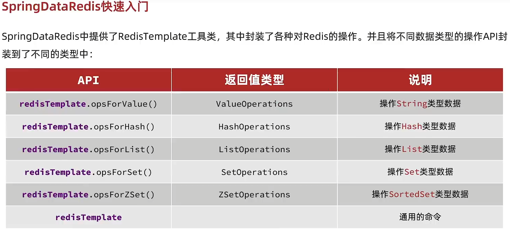

# 3.SpringDataRedis基础

## 3.1 SprinDataRedis基础api


## 3.2 使用步骤
## 1.导入依赖
```xml
<!--SpringDataRedis依赖		-->
<dependency>
    <groupId>org.springframework.boot</groupId>
    <artifactId>spring-boot-starter-data-redis</artifactId>
</dependency>
<!--连接池依赖-->
<dependency>
    <groupId>org.apache.commons</groupId>
    <artifactId>commons-pool2</artifactId>
</dependency>
```
## 2.配置文件
#### 重点：配置文件时SpringBoot3.x Spring后面要加上 data:
```yaml
spring:
  data:
    redis:
      host: localhost     # Redis服务器地址
      port: 6379          # Redis服务器连接端口
      password: 123456    # Redis服务器连接密码（默认为空）
      database: 0         # Redis数据库索引（默认为0）
      timeout: 60s        # 连接空闲超过N(s秒、ms毫秒，不加单位时使用毫秒)后关闭，0为禁用，这里配置值和tcp-keepalive值一致
      # Lettuce连接池配置
      lettuce:
        pool:
          max-active: 10  # 允许最大连接数，默认8（负值表示没有限制），推荐值：大于cpu * 2，通常为(cpu * 2) + 2
          max-idle: 8     # 最大空闲连接数，默认8，推荐值：cpu * 2
          min-idle: 0     # 最小空闲连接数，默认0
          max-wait: 5s    # 连接用完时，新的请求等待时间(s秒、ms毫秒)，超过该时间抛出异常，默认-1（负值表示没有限制）
```
## 3.序列化和反序列化配置类
- ##### 自动序列化和反序列化(已经配置好应该怎么处理) 使用redisTemplate
弊端是存入Redis的数据会消耗内存存入反序列化时需要的原本的java类
```java
@Configuration
public class RedisConfig {
    @Bean
    public RedisTemplate<String, Object> redisTemplate(RedisConnectionFactory redisConnectionFactory){
        //创建RedisTemplate对象
        RedisTemplate<String, Object> template = new RedisTemplate<>();
        //设置连接工厂
        template.setConnectionFactory(redisConnectionFactory);
        //创建JSON序列化工具
        GenericJackson2JsonRedisSerializer jsonRedisSerializer = new GenericJackson2JsonRedisSerializer();
        //设置Key的序列化
        template.setKeySerializer(RedisSerializer.string());
        template.setHashKeySerializer(RedisSerializer.string());
        //设置Value的序列化
        template.setValueSerializer(jsonRedisSerializer);
        template.setHashValueSerializer(jsonRedisSerializer);
        //返回
        return template;
    }
}

```
- ##### 手动序列化和反序列化 使用stringRedisTemplate
```java
private static final ObjectMapper mapper = new ObjectMapper();
@Test
void testSaveUser() throws JsonProcessingException {
    //创建对象
    User user = new User(1L,"Mommrm","123456","1295821492@qq.com","1");
    //手动序列化
    String json = mapper.writeValueAsString(user);
    //写入数据
    stringRedisTemplate.opsForValue().set("user:1",json);
    //获取数据
    String jsonUser = stringRedisTemplate.opsForValue().get("user:1");
    User user1 = mapper.readValue(jsonUser, User.class);
    System.out.println("user1: " + user1);
}
```


## 4.注入RedisTemplate
```java
@Resource
private RedisTemplate<String,Object> redisTemplate;
```

## 5.使用RedisTemplate
```java
@Test
void contextLoads() {
  redisTemplate.opsForValue().set("name","虎哥");

  Object name = redisTemplate.opsForValue().get("name");
  System.out.println(name);
}
```