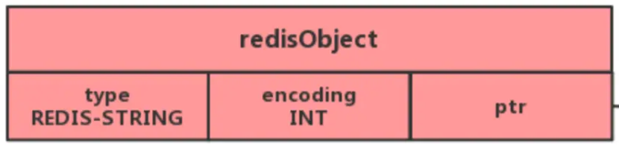

## 什么是Redis？

Redis是一个基于C语言开发的NoSQL数据库，它是保存在内存里面的内存数据库，因此读写速度非常快(少了IO操作)，Redis存储的是KEY-VALUE键值对类型的数据

## Redis的基本数据类型？

- String: 
    - 介绍：最基本的Keu-Value结构，不仅可以存放字符串，还可以存放数字(整数，浮点)
    - 内部实现：主要是int和SDS(简单字符串)，字符串内部编码encoding：int,raw,embstr(整数intm,长度小于32字节embstr，大于32字节raw)
                SDS结构是:free、len、buf[]
    - 应用场景：缓存对象、常规计数、分布式锁
- Hash: 
  - 介绍：是一个键值对集合，Redis中的value就是键值对的集合(套娃)
  - 内部实现：压缩列表和哈希表(和List类似)，但在Redis7.0后使用listpack替换了压缩列表
  - 应用场景：缓存对象(缓存对象也可使用String类型加Json的方式来实现)、购物车(用户Id为key、商品id为field、商品数量为value)
- List: 
  - 介绍：简单的字符串列表，按照顺序插入，可以从头部或尾部插入元素
  - 内部实现：双向链表或压缩列表，但在Redis3.2后使用了quickList替换了双向链表和压缩列表
          - 压缩列表：当列表元素小于512个时，列表每个元素都小于64字节
          - 双向链表：否则使用这个结构
          - 在
  - 应用场景：消息队列(一般不推荐，使用LPUSH和RPOP来实现，缺点是要不断通过RPOP来获取消息，可以通过BRPOP来实现阻塞式获取信息)
        - 消息队列三种要求：消息保持顺序执行，处理重复的消息，消息可靠性(消息还未处理完就宕机了)
        - 缺点: 不支持多消费者(Stream可以解决)
- Set:  
  - 介绍：无序并唯一的集合(最重要的是可以实现交INTER KEY1 KEY2, 并SUNION KEY1 KEY2, 差SDIFF KEY1 KEY2 集合运算)
  - 内部实现：哈希表或整数集合(当集合元素数量小于512个时，使用整数集合，否则使用哈希表)
  - 应用场景：点赞(key是文章id, value是用户id, 实现文章点赞功能),共同关注，好友推荐(key是用户id，value是用户关注的其他用户id)、抽奖活动
- Zset: 
  - 介绍：相比Set类型多了一个Score来实现排序,值不可以重复，但是Score可以重复
  - 内部实现：压缩列表或跳表来实现(当Zset里面的元素小于128个，且里面每一个的元素大小小于64字节时，使用压缩列表，否则使用跳表)，Redis7.0后使用listpack数据结构来实现
  - 应用场景：点赞评论排行榜(歌曲id为key,点赞数为score，评论id为value)当打开歌曲详细页面时可以获取歌曲评论排行榜，根据返回排序返回的评论id去数据库查询评论内容(可以只查询前5条)

