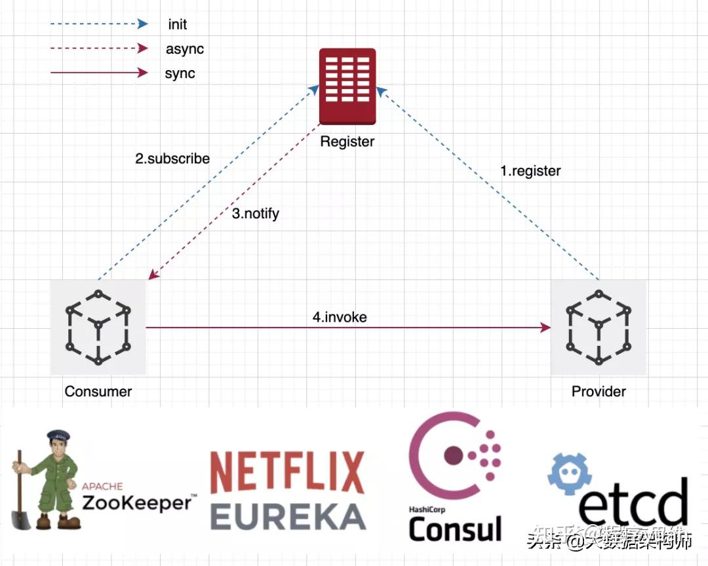

## 海鹚科技笔试

1. 什么是微服务架构，微服务优势和挑战？
微服务架构是一种分布式系统架构，将应用程序拆分为一系列小型服务，每个服务都运行在其独立的进程中，并使用轻量级通信机制相互通信，以实现业务逻辑。
优势：
> 1. 单一职责
> 2. 轻量级通信
> 3. 独立性
> 4. 进程隔离
> 5. 混合技术栈和混合部署方式
> 6. 简化治理
> 7. 安全可靠，可维护

挑战
> 1. 分布式固有的复杂性
> 2. 运维成本
> 3. 版本管理

2. 什么是注册服务与发现？
是微服务核心组件之一：
> 1. 服务注册与发现
> 2. API 网关服务
> 3. 分布式配置中心
> 4. 服务通信
> 5. 服务治理
> 6. 服务监控
> 7. 分布式服务追踪

 服务注册与发现流程原理：
 
 三个角色 
 - provider：服务提供者，向注册中心注册服务，并提供服务
 - consumer：服务消费者，向注册中心订阅服务，并调用服务
 - registry：注册中心，存储服务信息，包括服务地址、服务元数据、服务状态等

3. #{}和${}的区别？

4. mybatis中的pagehelper和mybatis-plus的分页的原理分别是什么?
5. 
在MyBatis中，PageHelper是一个用于实现分页功能的插件，它通过拦截SQL语句并在查询结果中进行分页处理来实现分页功能。PageHelper提供了丰富的配置选项，可以根据需要进行灵活配置。 
 
而MyBatis-Plus是一个基于MyBatis的增强工具，它提供了一系列增强的功能，包括分页查询。MyBatis-Plus的分页功能是通过继承MyBatis的RowBounds类实现的，它通过在查询语句中添加limit关键字和偏移量来实现分页功能。 

5. 微服务中调用feigh，怎么传递用户信息？

feign远程调用的时候，有时候也需要把消费者端的用户信息传递到服务提供者端，否则可能因为没有用户信息而无法调用接口。feign调用并不会走网关，是由服务消费者直接去调用服务提供者，在消费者端已经有userId的前提下，只需要把userId放到Http的请求头中就可以继续复用微服务中HandlerInterceptor对userId的处理逻辑了。

一道多表查询SQL

一道算法，求二叉树最大深度